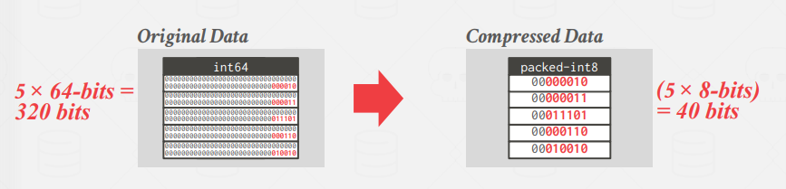
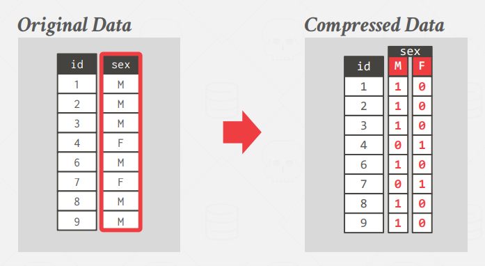
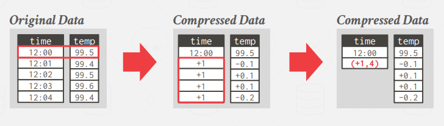

# CMU15445

**声明：以下内容均为个人学习使用，不做任何商业用途。文字和图片来源于[cmu15445](https://15445.courses.cs.cmu.edu/fall2022/schedule.html)**。

**Disclaimer: The following content is for personal learning use, not for any commercial use. Text and pictures are from [cmu15445](https://15445.courses.cs.cmu.edu/fall2022/schedule.html)**.

------

使用文件系统存储数据：

- 数据完整性（如何确定某个字段值是否相等，某个字段值是否合法，某个字段如果有多个值，删除）
- 实现（查询，给上层提供相同的接口，多线程）
- 持久性（更新时宕机，分布式）

------

关系型数据库: 

- 使用简单的数据结构（关系）存储数据
- DBMS实现物理存储
- 通过高级语言获得数据，DBMS决定最佳的执行策略

------

## 数据库存储：

​	DBMS假定主要存储在磁盘上。因为磁盘是非易失的，并且成本较低且存储空间较大。

​	由此产生的问题：磁盘上的访存速度非常慢，且随机访问的速率远小于顺序访问。

​	因此，DBMS需要解决以下问题：

- **允许DBMS管理比实际内存更大的空间**
- **减少磁盘的读写**
- **最大化顺序访问磁盘**

​	相关工作：

- mmap：[Why not mmap](https://db.cs.cmu.edu/papers/2022/cidr2022-p13-crotty.pdf)

------

​	同时，数据库往往会以多个文件的形式存储在磁盘上，一般我们通过一个页面的集合去管理这些文件。页面是固定大小的数据块，硬件页面是存储设备可以保证故障安全写入的最大数据块。由此我们会有以下问题：

- **如何确定页面的大小？**
- **对不同文件如何进行页面管理？（Heap, Tree, ISAM, Hashing）**

​	这门课中主要介绍了堆文件管理方式。堆文件是一些页面的无序集合。因此需要原数据跟踪文件中包含哪些页面以及哪些页面是空闲的。堆文件通过一个特殊的页面（页目录）跟踪数据页面的位置以及空闲的空间。

​	页面存储数据的方式：存储元组；存储日志

    
     
    
slotted page

​	如上图所示，常见的页面存储元组的方式为slotted page。这一方式存在以下问题：

- **会有内碎片**
- **Random Disk I/O(e.g., update 20 tuples on 20 pages)**
- **Useless Disk I/O**（好像和上一条意思差不多）

​	在页面设计上同样可能面临更多的限制，比如：

- **无法over_written**
- **一个块中的页内必须从低地址往高地址顺序写**
- **块被擦除的次数有限**

​	元组：按列顺序存储数据，去规范化。可以优化的点：

- **按什么顺序存储数据？**
- **trade off: 去规范化（比如两个表有个外键关联，把两张表的元组存储在一起）。这样可能可以减少I/O的总量，但是会增加修改的成本。**

​	日志：每次对数据库进行更改时，DBMS将日志记录附加到文件的末尾，而不检查以前的日志记录。这样可以解决页面无法over_written的问题以及slotted_page对磁盘随机访问的问题，使得每一次写磁盘都是顺序的。

​	由于日志的增长是无止境的，因此我们需要定期进行日志的压缩。日志压缩需要考虑的问题有：

- **页面之间的时间顺序（这里考虑优化一下堆文件管理，让每个文件中的页面id有序，这样可以提高未来的查询效率）**
- **文件的合并需要什么条件（universal compaction：合并有相邻page id的文件。level compaction：后续补一下[Leveldb]([google/leveldb: LevelDB is a fast key-value storage library written at Google that provides an ordered mapping from string keys to string values. (github.com)](https://github.com/google/leveldb))的坑）**

​	日志的缺点：

- **写需要写更多的内容**
- **日志压缩开销大**

------

​	数据：这一部分的问题包括：

- **任意精度的小数：[libfixeypointy](https://github.com/cmu-db/libfixeypointy)**
- **大数值：overflow page(额外的页面存溢出数据), [external file](https://www.microsoft.com/en-us/research/wp-content/uploads/2006/04/tr-2006-45.pdf)（专门存储大数值的文件，这个文件没有持久性和事务保护）**

------

​	数据库负载：

- OLTP：读写小量数据
- OLAP：读大量数据进行聚合计算
- HTAP：OLTP + OLAP together

​	根据不同的数据库负载类型我们可以对页面存储数据方式进行优化，比如对于OLAP我们可以采用DSM的方式，即将跨元组的单属性值连续存储在页面中（这样可以减少I/O的访存量，可以更好的进行查询和数据压缩，但同时对单点操作不利，因为一个tuple的不同属性分布在不同页上）。

------

​	数据库压缩：由于在现实世界中数据集在某个属性上的值往往具有高度偏斜性，同时同一元组之间的不同属性之间往往也具有高度的相关性。因此我们可以基于这些特点对数据库进行压缩。数据库的压缩必须保证压缩后的值是定长的（Why?），查询执行时必须尽可能推迟解压缩，必须是无损的。数据库压缩你需要考虑以下问题：

- **计算开销**
- **压缩与解压缩的速度**

​	重点介绍一下对DSM方式存储的数据进行压缩。可行的方案包括：

- run-length encoding(对数据的排序具有要求)：

    
     
    
run-length encoding

- bit-packing encoding

    
     
    
bit-packing encoding

- mostly encoding(对bit-packing的进一步优化)

    
     
    
mostly encoding

- bitmap encoding(低基类类别变量，类似于One-hot)

    
     
    
bitmap encoding

- delta encoding(可结合RLE，对数据平稳性有要求)

    
     
    
delta encoding

- incremental encoding(类似于上一个，但是这个是针对字符串的，所以取公共前缀作为基底)

- dictionary compression(需要注意dictionary的大小，没有magic hash function可以同时做到编码和解码，Andy认为这一方法可能是最有效的方法，因为不需要预排序)

    
     
    
dictionary compression

------

​	之前我们了解了数据库在磁盘上的存储，进一步我们需要解决磁盘和内存之间的来回移动问题。我们需要解决以下问题：

- **页面应该写到磁盘的哪里（我们应该尽可能让经常使用的页尽可能的靠近）**
- **什么时候需要把页面读入内存，什么时候需要把页面写回磁盘（我们应该尽可能减少I/O访存的次数）**

Why not page cache:

- 多余的页面副本
- 不同的替换策略
- DBMS失去了对文件I/O的控制

 

buffer pool

source from [eleven's zhihu](https://zhuanlan.zhihu.com/p/571927310)

​	缓存池大致的运行过程如上图所示，在实验中我们的page table的底层实现是extendible hash table，用来得到页号和页框号的映射关系。当缓存池满并且需要调取新的页面到内存时，需要合适的替换策略。在实验中，我们采用的LRU-K算法。这里我们分析一下各替换策略：

- LRU：给每个页面维护一个单独的时间戳，选取最老的时间戳进行驱逐。
- CLOCK：每个页面有个参考位，如果页面被访问则置为1。如果需要驱逐页面，则从当前位置开始，如果参考位为1，则置为0，否则驱逐。

​	**缺点：在某些工作负载中，最近使用的页面是最不需要的页面**

- LRU-K：记录page最近k次引用的时间，如果有小于k次的，则驱逐这些小于k次的页面中时间戳最老的。否则驱逐所有页面中最老的。
- localization：给查询单独一个缓冲池
- priority hints：

​	页面替换过程中还需要考虑脏页，因为脏页还需要写回到磁盘中去。

​	缓存池的一些优化方案：

- 多缓冲池
- 根据查询计划，预取
- 扫描共享（不一定是一个有价值的功能，因为两个事务很难看到同样的结果，more details see [here](https://stackoverflow.com/questions/62185855/shared-scanning-in-postgres)）
- [轻扫描](https://www.ibm.com/docs/en/informix-servers/12.10?topic=io-light-scans)，即顺序查询算子不将结果存储在缓存池中。

------

## 获取方式

​	接下来，我们将讨论DBMS如何从一个页面中获取到他们想要的数据。

​	Hash Table：时间复杂度最优秀的单点查询，平均时间复杂度为O(1)，最坏情况下为O(n)。需要考虑的设计有：

- **[哈希函数](https://github.com/rurban/smhasher)（需要权衡计算花费和冲突率）**
- **处理哈希冲突（需要权衡分配一个大的哈希表和额外的空间去存取key）**

​	我们主要考虑第二个问题。对于分配一个大的哈希表的有以下几种解决方案：

- linear probe hashing(插入时，如果发生冲突，则往后面找到第一个空位插入。删除时，立一块墓碑，方便之前插入时有冲突的其他key的查询)

  

- robin hood hashing(插入时，如果发生冲突，则冲突次数低的让位冲突次数高的，让冲突次数低的再去线性探查新的位置)

  

- cuckoo hashing（插入时，用两个哈希函数和哈希表，如果在第一张表发生冲突，则尝试插入第二张表，如果第二张表依然发生冲突，则抢占该位置的元素，让该位置元素尝试插入第一张表，如果依然发生冲突，则抢占第一张表该位置的元素，让第一张表该位置的元素尝试插入第二张表。）

​	使用额外的空间去存取key有以下几种方案：

- chained hashing：每个slot维护一个链表，发生冲突时插入到链表中

  

- extendible hashing：发生冲突时桶分裂，然后重新构造这类产生冲突的key的哈希函数（映射二进制下后x位->二进制下后(x+1)位），并将桶分裂前的数据和本次插入的数据重新哈希进分裂后的桶中。

  

- linear hashing

​	B+Tree：建立索引可以实现表的高效访问，DBMS需要识别出每次执行的最佳索引，但是索引也会带来额外的空间开销和维护开销。你在设计一个B+树时，需要考虑以下方面：

- **节点大小：依赖于存储设备和工作负载**
- **延迟合并节点/小节点存活，定期重构**
- **不定长的key(指针；填充；key map；认真维护)**

​	B+树的优化策略：

- 对key进行压缩
- 批处理插入

​	B+树的并发控制：采用读写锁（可以共享读）。B+树采用latch crabbing，即从根节点往下遍历时不会立刻释放锁，而是当确定孩子节点是安全时（对于读操作，始终是安全。对于插入操作，不可能发生分裂的节点是安全的。对于删除操作，不可能被合并的节点是安全的），才会释放锁。B+树的并发还有一些细节和优化：

- 需要为root page加锁，因为root_page_id的访问需要被锁保护

  

- 删除时需要对兄弟节点加锁，原因是因为当一个安全的子节点先发生删除而它的兄弟节点后发生不安全的删除时，可能不安全的兄弟节点会先发生合并。同时，给兄弟节点加锁是不会导致死锁的，因为同一个父节点下不可能有两个子节点发生不安全的删除。

  

- 乐观锁：由于每次写操作都会对根节点上写锁，但实际上大部分的写操作都不会导致根节点的变化，因此我们可以考虑乐观锁。即在向下加锁的过程中一直加读锁，最后给叶子节点加写锁即可。如果发现叶子节点是不安全的，释放所有乐观锁，重新加入悲观锁。

------

## 算子执行

 

project structure

​	一条sql语句，首先经过Parser生成AST。然后通过Binder将树的节点和数据库的实体进行绑定。之后Planner会遍历树，生成初步的查询计划。这些查询计划会交给Optimizer进行修改优化。在拿到真正的执行查询计划之后，遍历查询计划树，将树上的PlanNode替换为对应的Executor，由Executor执行具体的算子。

 

How Executor Get Data

source from [eleven's zhihu](https://zhuanlan.zhihu.com/p/587566135)

​	Executor拿到一个Tuple的数据的过程如上图所示（除此之外，Catalog中还有index info，可以进行索引的查询）。接下来我们按照Andy的教课顺序，首先从具体的算子实现说起。

------

​	排序:

- TOP-N优化: 比如一条SQL有Order by和Limit，这时可以通过heapsort进行优化。
- External merge sort: 需要排序的数据超出内存。
- 比较优化:进行比较的硬编码/字符串比较二进制前缀而不是字符前缀
- B+树

​	聚合:

- 排序聚合:先排序再聚合
- 哈希聚合:先通过hash函数h1将所有的元组在磁盘上进行分区，相同哈希值的在一个分区中。对于磁盘上的每个分区读入内存并通过hash函数h2进行聚合。

​	Join:

- Nested loop join: R×S, simple nested loop join会对R中的每一个tuple都需要取一次S表的所有pages。一个简单的优化Blocked nested loop join是对于R中同一page的tuple我们取一次S表的所有pages。到这里我们发现基本的Nested loop join之所以慢是因为对于每一次匹配都需要顺序扫描一遍S表。所以我们可以使用索引进行优化S表的顺序扫描。

  

- Sort-Merge join:当其中一个表已经排好序或者输出必须有顺序时可以使用。

  

- Hash join:先用外表建立hash table, 然后扫描一遍S检查是否匹配。可以在第一个阶段建立bloom filter加速，因为bloom filter和cpu caches更适配。bloom filter维护一个bitmap，插入时会通过k个哈希函数，将这些位的值置为1，查找时判断这些位是否都为1。bloom filter会出现假阳性的情况，但是不可能出现假阴性，也就是说对key不在这个集合中的判断是准确的。

------

​	事实上，Executor之间是有数据移动的。因此我们需要权衡应该用什么样的处理模型去适配我们数据库的工作负载。

- 火山模型: 每个算子都有Init()和Next()两个方法。分别进行初始化工作以及向下层算子请求下一条数据。当Next()放回salse的时候，迭代结束。占用内存小，函数调用开销大，容易造成cache miss等问题。

  

- Materialization Model: 所有算子立即计算出所有结果并返回。内存占用高，减少了函数调用的开销。

  

- Vectorization Model: 一次调用Next()返回一批数据。利于SIMD加速。

​	执行的方向:

- Top-to-Bottom:从上往下Pull数据
- Bottom-to-Top:从下往上Push数据

------

​	查询优化：略了，还不太懂

------

## 并发控制

​	事务的四大特性:

- 原子性: 事务要么执行完所有sql语句然后Commit要么一条都不执行然后Abort。(一般通过Logging的方式实现)
- 一致性: 数据库总是逻辑正确的，在事务发生前后数据库都保持一致性。
- 隔离性: 事务之间是不可见的。(通过并发控制实现)
- 持久性：

​	Serializable Schedule: 如果事务的按照一定的执行顺序得到的结果和事务串行得到的结果一致，我们就说这个执行顺序是serializable的。

​	如何判断一个执行顺序是serializable的:

- conflict serializable schedules: 构建冲突依赖图，如果没有环就说明是serializable的。
- view serializable: 根据经验加入规则判断是否是serializable的

------

​	二阶段锁:

​	事务运行之后首先进入第一个阶段: Growing阶段。在这个阶段事务只能请求加锁而不能释放锁。第二阶段为Shrinking阶段，在这一阶段事务只能释放锁，而不能加锁。(可以用反证法证明，这样一定是conflict serializable的。主要思路是：如果不是CSR，那么就一定有环。如果一个事务出度大于0，那么这个事务一定进入了Shrinking阶段，而一个事务入度大于0他一定获得了某个对象的锁，矛盾)

​	尽管二阶段锁一定能保证CSR，但是它会导致cascding aborts。比如，事务T1对A对象进行了写操作，之后释放了锁，然后T2对A对象进行了一系列操作，最后T1 Abort了，就会导致错误。

​	严格二阶段锁:在事务的最后把所有的锁一起释放。这样可以解决级联回滚的问题。但是仍然有可能导致死锁。因此需要进行死锁检测/预防。

------

​	锁的粒度:

​	意向锁:允许上级节点在共享或排他模式下被锁定，而不需要检查所有的下级节点。

------

​	隔离级别:

 

isolation levels

------

​	并发控制部分T/O, OCC, MVCC, 恢复部分Logging, Recovery, 分布式数据库略 
