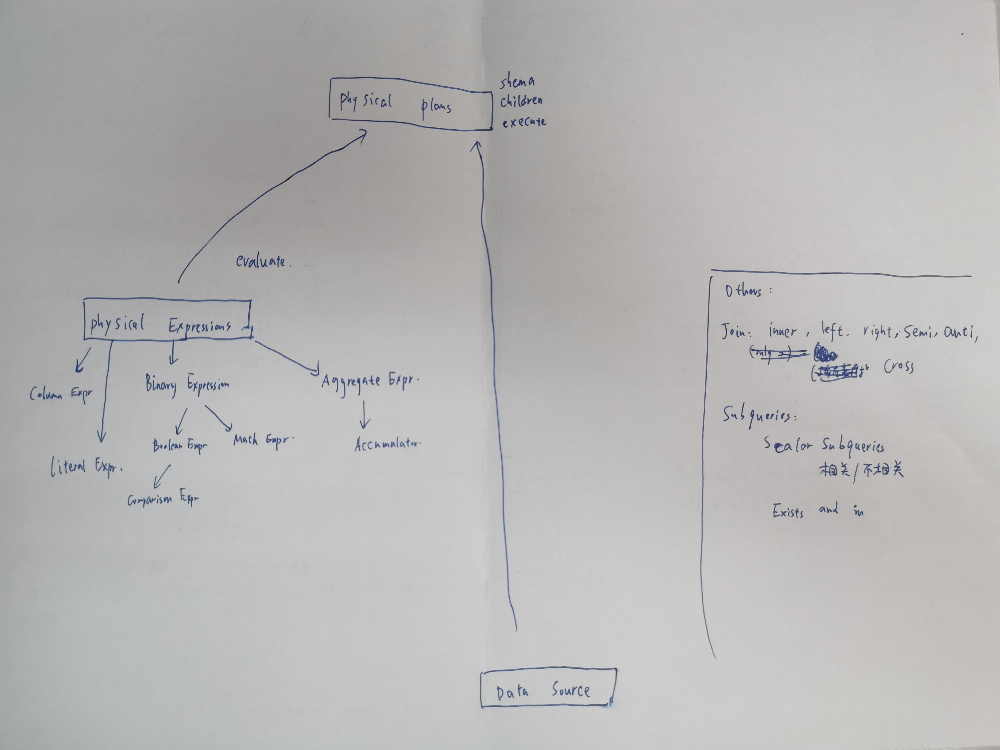

# CMU15721

## How Query Engines Work

  
   

  
   

生成的Logical Plan首先经过Query Optimizer优化。主要介绍Rule-Based Optimizations:

- Projection push-down:尽快过滤掉列。找到projection, filter, aggregate中需要用到的列。Scan时过滤。
- Predicate push-down:尽快过滤掉行。将fiter在join之前做。
- Eliminate Common Subexpressions
- Converting Correlated Subqueries to Joins

经过优化后通过Query Planner转换为Physical Plan。

并行查询执行：

- Combining Results: Map Reduce
- Smarter Partitioning: 负载均衡需要考虑。可以把文件放在目录中，并使用kv对组成的目录名称指定内容。这样可以更早的实现谓词下推，这种方法又叫做"partition pruning".

分布式查询执行：

- Joins：必须首先在连接键上对两个表重新分区，并把分区写入磁盘。
- 需要一个查询调度程序：
  - 生成分布式的Query Plan
  - 序列化Query Plan
  - 序列化数据
  - 选择通信协议
  - 优化

------

## In Memory Database
