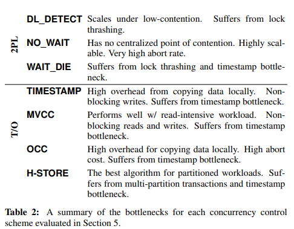
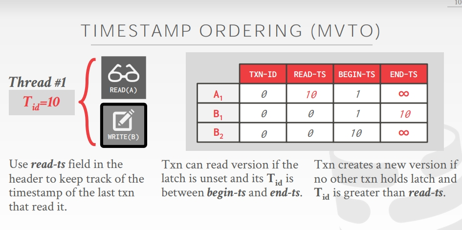
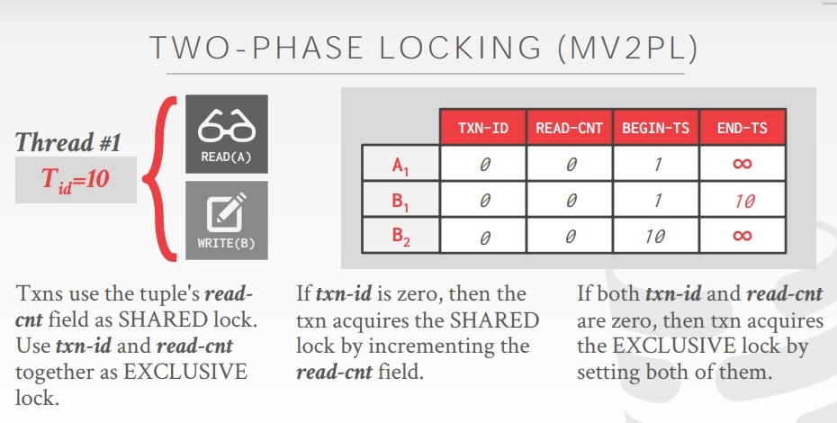
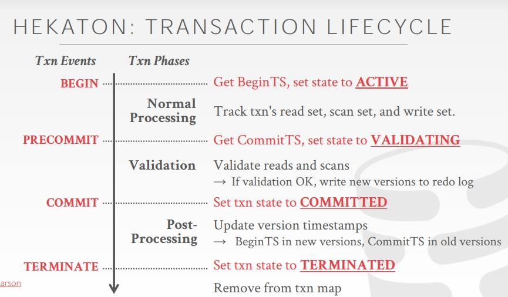

# CMU15721

## How Query Engines Work

  
   

  
   

生成的Logical Plan首先经过Query Optimizer优化。主要介绍Rule-Based Optimizations:

- Projection push-down:尽快过滤掉列。找到projection, filter, aggregate中需要用到的列。Scan时过滤。
- Predicate push-down:尽快过滤掉行。将fiter在join之前做。
- Eliminate Common Subexpressions
- Converting Correlated Subqueries to Joins

经过优化后通过Query Planner转换为Physical Plan。

并行查询执行：

- Combining Results: Map Reduce
- Smarter Partitioning: 负载均衡需要考虑。可以把文件放在目录中，并使用kv对组成的目录名称指定内容。这样可以更早的实现谓词下推，这种方法又叫做"partition pruning".

分布式查询执行：

- Joins：必须首先在连接键上对两个表重新分区，并把分区写入磁盘。
- 需要一个查询调度程序：

- 生成分布式的Query Plan

- 序列化Query Plan

- 序列化数据

- 选择通信协议

- 优化

------

## In Memory Database

- **Staring into the Abyss: An Evaluation of Concurrency Control with One Thousand Cores**

**Motivation:** 多核时代到来，由于数百个线程并行运行，协调竞争数据访问的复杂性将成为可扩展性的主要瓶颈，并且可能会减少增加核心数量带来的收益。这篇文章在主存数据库上实现了七种并发控制算法，并在1000核的CPU模拟器上对这些算法进行评估多核可扩展性。

**并发控制算法：**

- 2PL with Deadlock Detection (DL_DETECT)
- 2PL with Non-waiting Deadlock Prevention (NO_WAIT)：锁请求被拒绝时终止事务，预防死锁发生
- 2PL with Waiting Deadlock Prevention (WAIT_DIE)：如果事务比持有锁的事务早，则允许等待，否则中止并重新启动。
- Basic T/O (TIMESTAMP):读写到晚的时间戳就会abort并重新启动，读时会复制一份。
- MVCC：维护版本列表。
- OCC：写操作在私有工作区进行，提交时判断与其他事务有无重叠。有重叠时终止并重新启动，无重叠则更新到数据库中。
- T/O with Partition-level Locking (H-STORE):数据库分区，每个分区分配一个单线程执行引擎。每个事务开始运行时需要获取访问他所有分区的锁，事务请求到达时分配时间戳，添加到目标分区的所有锁获取队列中。如果事务具有队列中最旧的时间戳，则分区的执行引擎在队列中删除事务并分配给该事务分区访问权限。

​	**通用优化：**

- 内存分配：每个线程分配自己的内存池，根据工作负载自动调整池的大小
- Lock Table: 没有表锁，只有行锁
- Mutexs

​	**2PL锁优化：**

- 死锁检测：多线程更新单个waits-for图导致性能瓶颈, partitioning the data structure across cores and making the deadlock detector completely lock-free
- Lock Thrashing: 2PL主要瓶颈，事务需要直到提交才会放锁。
- Wating vs aborting:给每个事务一个等待阈值，超过阈值则重启，以减少Lock Thrashing问题。

​	**TO优化：**

- 时间戳分配：需要保证每个时间戳仅分配给一个事务。
- 分布式验证：在OCC读的最后阶段，事务的读集合需要与之前事务的写集合比较检测冲突。We solve this problem by using per-tuple validation that breaks up this check into smaller operations.
- 本地分区：we allow multi-partition transactions to access tuples at remote partitions directly instead of sending query requests that are executed by the remote partitions’ worker threads. 

​	**Discussion:**

  
   

------

## MVCC(Design Decisions)

- **An Empirical Evaluation of In-Memory Multi-Version Concurrency Control**

**Motivation:**MVCC在当今的数据库中广泛运用，但是有许多的设计选择可以实现MVCC。直到现在，没有对多核的in-memory数据库全面的评估各种设计选择下MVCC的性能。本文对MVCC DBMS中关键事务管理设计决策进行了研究：1）并发控制协议，2）版本存储，3）垃圾收集，4）索引管理

**MVCC:**好处是读写不会相互阻塞，并且有时间旅行的功能。写写冲突时，先写的获胜，后写的事务abort。Snapshot isolation(SI)不是串行化的原因是因为会造成Write Skew Anomaly。（如何 Serialization？）

**Meta-Data:** 每个事务进入系统会分配一个Tid。每个Tuple的Header一般包括txn-id(用于上锁并发控制事务), begin-ts（有效范围，如果删除了就是INF）, end-ts, pointer（相邻版本的地址）。

**并发控制协议：**

  
   

  
   

txn id wraparound: Set a flag in each tuple header that says that it is "frozen" in the past. Any new txn id will always be newer than a frozen version.

**Version storage:**

- Append-only:每次更新都在表空闲空间追加tuple一个新的版本。（Oldest-to-Newest:利于写，Newest to Oldest:利于读）
- Time-travel:每次更新，将现版本移动到time travel表上，重新主表内容并更新指针。
- Delta storage:每次更新只复制值到delta storage中并重写主表内容，可以通过进行相反的增量得到老版本。

​	non-inline attributes: 多版本可以重用指针。需要进行引用计数。

**Garbage collection:**

- Tuple-level gc:Background Vacuuming（单独开一个线程定时清理过期版本。），Cooperative Cleaning（当遍历版本时清理过期的，只适用于O2N）
- Transaction-level gc：当一个事务对其他事务不可见时，该事务生成的版本都可以被安全释放。

**Index Manager:**

- Logical Pointers
- Physical Pointers

MVCC DBMS indexes一般不存version信息。每个索引需要支持来自不同版本的重复keys。

**Discussion:**

- Version stage对性能影响非常重要。Append-only和Time Travel非常依赖于底层内存分配方案效率，而Delta则都能保持一个较高的性能。但是Delta表扫描性能较低。
- MVTO在多种工作负载情况下表现就好。
- a transaction-level GC provided the best performance with the smallest memory footprint.
-  logical pointer scheme永远更好。

------

## MVCC(Protocols)

**Fast Serializable Multi-Version Concurrency Control for Main-Memory Database Systems**（HYPER MVCC）

- HEKATON MVCC:

  
   

​				HEKATON使用了乐观事务，在事务结束时需要检查之前读的版本是否依				然可见，以及重复所有的Index scan来检查幻读。HEKATON的缺点在于：				Read/scan set validations在读取大量数据时非常昂贵；添加新的版本会导				致OLAP scan性能变得糟糕；级联回滚。

- HYPER MVCC：

  
   

​				通过First-Writer Wins使得所有的事务的写集不会重合。通过**Precision  				locking**解决幻读问题。只需要存储txn's read predicates而不需要存储整				个read set。

- SAP HANA: In-memory HTAP DBMS with time-travel version storage.O2N的版本存储，事务元数据不存储新版本的数据，而是指向context object的指针。这样会导致更慢的读（O2N），但是大型更新会更快，因为会通过一次写入更新所有元组。

MVCC LIMITATIONS: version chain的cache miss率高，需要频繁的垃圾回收。共享内存写，时间戳分配。

OCC LIMITATIONS:aborts频率高，额外的读写(copy)，index contention。

- CMU CICADA:将热点数据尽量存储在record meta-data中。Fast validation(优先validate热点数据，全局写前pre-validate访问集，从上次查询的version list位置开始查询)。所有的index node存储在表中（相当于每个index node也做了mvcc）。
