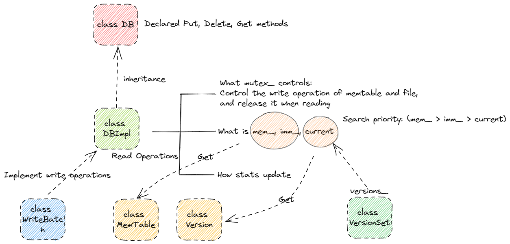

# leveldb

​	在阅读源码之前，我们应该去关注以下问题:

- 为什么会有NoSQL数据库的出现, 这样的数据库解决了关系型数据库哪方面的不足

------

[source code](https://github.com/google/leveldb)

[build && simple use in windows 11](https://zhuanlan.zhihu.com/p/558559654)

------

## Overview:

LevelDB is a fast key-value storage library written at Google that provides an ordered mapping from string keys to string values.

------

## Features:

- 键值为任意字节数组
- 数据会按键的顺序存储
- 用户可以自定义比较函数
- 基本的操作为增，删，查
- 在一个原子批次中对数据库进行一系列的编辑，并且保证这些编辑按顺序应用。除此之外还能将大量的修改放入一个批次中进行加速(WriteBatch)
- 用户可以创建一个瞬时快照去获得一致的数据视图
- 提供向前和向后的迭代器
- 使用Snappy压缩库自动压缩数据，但也支持Zstd压缩
- 外部活动通过虚拟界面进行中继，因此用户可以自定义操作系统交互

------

## Test Features:

my test code is [here](https://github.com/nixianjun6/leveldb_test).

------

## Data Structure:

​	**Slice**: 由于string类在返回时，会进行一个拷贝操作，而Slice则只需要返回长度和指针，这样保证了对于任意字节数组的键值都有较好的性能。除此之外，Slice不以'\0'作为字符的终止符，可以存储值为'\0'的数据。

​	**Comparator:** 纯虚类，用于用户自定义比较函数。主要需要实现四个接口比较函数，比较器的名字，以及用于两个压缩字符串存储空间的方法: FindShortestSeparator,  FindShortSuccessor。思考:

- 为什么比较器需要实现两个用于压缩字符串的方法?
- 这两个方法的使用场景有什么区别?

​	**[SkipList](https://15721.courses.cs.cmu.edu/spring2018/papers/08-oltpindexes1/pugh-skiplists-cacm1990.pdf):**我们知道对于一个有序链表而言，它的查找和插入的复杂度都为O(n)。限制有序链表性能的一个重要原因在于它无法进行二分查找。而如果我们采用如下图建立多级索引的方式，我们将能够以O(logn)的时间复杂度查询到我们想要的值。例如，我们需要查找13，我们会从最高级Level 4开始查找。发现下一个Node是INF > 13，因此我们降低高度，从Level 3继续查找。下一个Node是8 <= 13， 因此我们跳转到8的节点，继续查找，发现下一个Node是INF > 13。我们降低高度，从Level 2继续查找，下一个Node是12 <= 13，因此我们跳转到12这个节点。以同样的方式进行查找，最后我们发现12这个节点在level 0的下一个节点是13。这样我们保证每次横向跳跃都筛除了一半的数据，而纵向跳跃的次数是小于等于logn的，因此我们的查找效率为O(logn)。

  
   
    
perfect skiplist

[source from stack Exchange](https://codereview.stackexchange.com/questions/159256/cpp-skiplist-for-numeric-values)

虽然这样大大优化了链表的查询效率，但是这样会带来额外的空间开销:(n/2 + n/4 + ... + 1) = n个节点的空间。同时，这让新节点的插入成为了一个难题（当一个节点插入后需要修改该节点后续所有节点的height）。为了解决这个问题，Pugh提出了一个巧妙的办法：即只保证每一层的节点数量按概率分布（例如50%的节点为1层节点，25%节点为2层节点,...），而不要求每个位置的节点的高度。这样可以保证插入的节点只用修改前驱节点的指针即可，而不需要改变其他节点的高度（具体数学证明见论文）。这样跳表就保证了插入和查询的时间复杂度都为O(logn)。

  
   
    
leveldb skiplist

关于leveldb在skiplist设计上的一些选择问题：

- 每层节点数量满足概率为p的几何分布, 这个p值的选取为1/4, 这样牺牲掉了一些常数的查询效率，换取了n / 2个节点内存空间的使用。论文中也推荐p=1/4，除非有非常严格的读速度。
- 高度最大值kMaxHeight=12，这样的选择让跳表最多支持4^12个值。
- 每个节点只能单向遍历，这样是在假定反向遍历很少的情况下以时间换空间的做法。

​	另外leveldb调表的一个难点在于提供不加锁的并发读的正确性保证，后续补。

------

## Code Reading:

​	首先，我们一起阅读数据库的读写部分。

  
   
    
How Leveldb read && write

​	读操作: 首先会进行上锁，并读出mem_, imm_, versions->current()。然后进行解锁，并依次在mem_, imm_, current中根据look up key进行查找。找到之后进行上锁，如果是从current中找到的，并且current更新了状态，会触发一个可能的压缩操作。之后，维护mem_, imm_, current的引用计数，并返回值。读这段代码我有三个问题:

- mutex_控制的是线程间什么样的并发过程?
- mem_, imm_, current分别是什么?
- 这里的状态更新是什么，为什么会触发一个可能的压缩操作?
