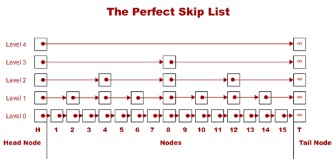
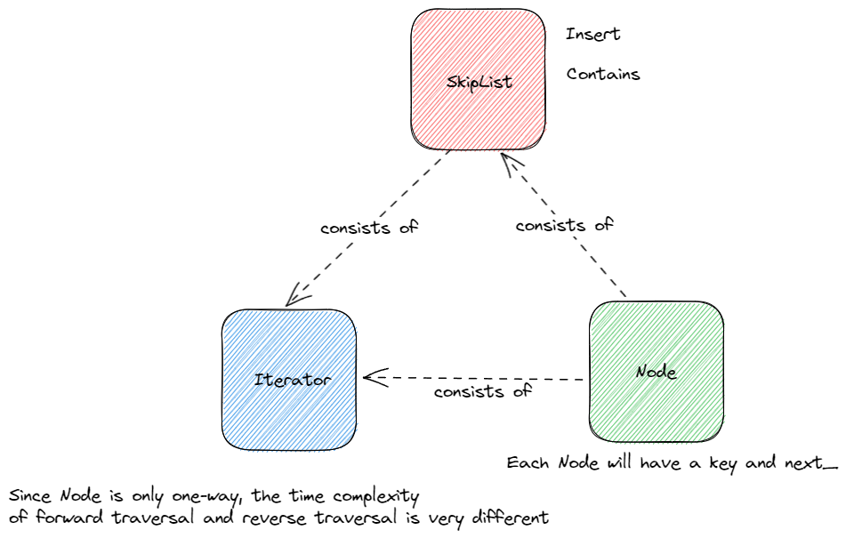
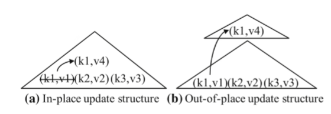
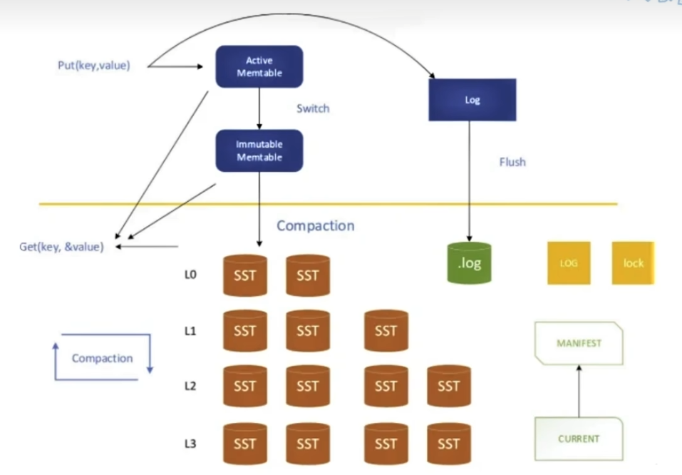
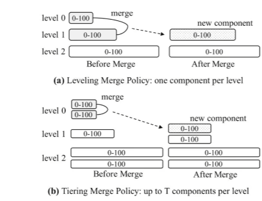
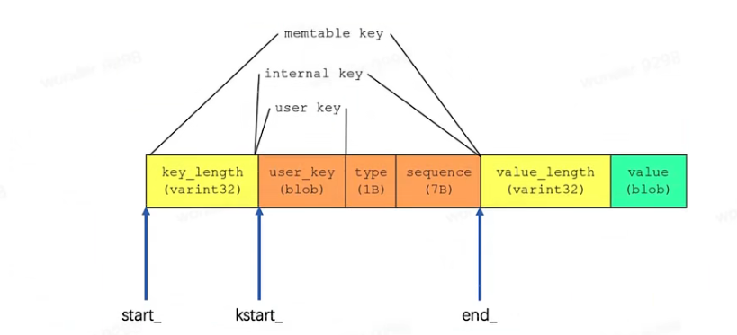

# leveldb

​	在阅读源码之前，我们应该去关注以下问题:

- 为什么会有NoSQL数据库的出现, 这样的数据库解决了关系型数据库哪方面的不足

------

[source code](https://github.com/google/leveldb)

[build && simple use in windows 11](https://zhuanlan.zhihu.com/p/558559654)

------

## Overview:

LevelDB is a fast key-value storage library written at Google that provides an ordered mapping from string keys to string values.

------

## Features:

- 键值为任意字节数组
- 数据会按键的顺序存储
- 用户可以自定义比较函数
- 基本的操作为增，删，查
- 在一个原子批次中对数据库进行一系列的编辑，并且保证这些编辑按顺序应用。除此之外还能将大量的修改放入一个批次中进行加速(WriteBatch)
- 用户可以创建一个瞬时快照去获得一致的数据视图
- 提供向前和向后的迭代器
- 使用Snappy压缩库自动压缩数据，但也支持Zstd压缩
- 外部活动通过虚拟界面进行中继，因此用户可以自定义操作系统交互

------

## Test Features:

my test code is [here](https://github.com/nixianjun6/leveldb_test).

------

## Data Structure:

​	**Slice**: 由于string类在返回时，会进行一个拷贝操作，而Slice则只需要返回长度和指针，这样保证了对于任意字节数组的键值都有较好的性能。除此之外，Slice不以'\0'作为字符的终止符，可以存储值为'\0'的数据。

​	**Comparator:** 纯虚类，用于用户自定义比较函数。主要需要实现四个接口比较函数，比较器的名字，以及用于两个压缩字符串存储空间的方法: FindShortestSeparator,  FindShortSuccessor。思考:

- 为什么比较器需要实现两个用于压缩字符串的方法?
- 这两个方法的使用场景有什么区别?

​	**[SkipList](https://15721.courses.cs.cmu.edu/spring2018/papers/08-oltpindexes1/pugh-skiplists-cacm1990.pdf):**我们知道对于一个有序链表而言，它的查找和插入的复杂度都为O(n)。限制有序链表性能的一个重要原因在于它无法进行二分查找。而如果我们采用如下图建立多级索引的方式，我们将能够以O(logn)的时间复杂度查询到我们想要的值。例如，我们需要查找13，我们会从最高级Level 4开始查找。发现下一个Node是INF > 13，因此我们降低高度，从Level 3继续查找。下一个Node是8 <= 13， 因此我们跳转到8的节点，继续查找，发现下一个Node是INF > 13。我们降低高度，从Level 2继续查找，下一个Node是12 <= 13，因此我们跳转到12这个节点。以同样的方式进行查找，最后我们发现12这个节点在level 0的下一个节点是13。这样我们保证每次横向跳跃都筛除了一半的数据，而纵向跳跃的次数是小于等于logn的，因此我们的查找效率为O(logn)。

  
   
    
perfect skiplist

[source from stack Exchange](https://codereview.stackexchange.com/questions/159256/cpp-skiplist-for-numeric-values)

虽然这样大大优化了链表的查询效率，但是这样会带来额外的空间开销:(n/2 + n/4 + ... + 1) = n个节点的空间。同时，这让新节点的插入成为了一个难题（当一个节点插入后需要修改该节点后续所有节点的height）。为了解决这个问题，Pugh提出了一个巧妙的办法：即只保证每一层的节点数量按概率分布（例如50%的节点为1层节点，25%节点为2层节点,...），而不要求每个位置的节点的高度。这样可以保证插入的节点只用修改前驱节点的指针即可，而不需要改变其他节点的高度（具体数学证明见论文）。这样跳表就保证了插入和查询的时间复杂度都为O(logn)。

  
   
    
leveldb skiplist

关于leveldb在skiplist设计上的一些选择问题：

- 每层节点数量满足概率为p的几何分布, 这个p值的选取为1/4, 这样牺牲掉了一些常数的查询效率，换取了n / 2个节点内存空间的使用。论文中也推荐p=1/4，除非有非常严格的读速度。
- 高度最大值kMaxHeight=12，这样的选择让跳表最多支持4^12个值。
- 每个节点只能单向遍历，这样是在假定反向遍历很少的情况下以时间换空间的做法。

​	另外leveldb调表的一个难点在于提供不加锁的并发读的正确性保证，后续补。

​	**LSM-TREE**:

  
   
    
update structure

​	常用的存储结构分为就地更新结构（B+树）和异位更新结构。就地更新结构由于随机写会产生较大的写开销，而异位更新结构因为顺序写的原因则可以在写上获取到优秀的性能。LSM树是异位更新结构的集大成者。同时由于SSD大大优化了读性能以及不具备覆盖写的特性，进一步促进了LSM树的发展。

​	存储结构的共性特点：

- 适合磁盘存储，IO尽量少且一次读取连续的区域。
- 允许并发操作，增删改对存储结构的影响尽量小。

  
   
    
LSM Tree

​		首先，写数据首先要记录WAL。然后数据有序写入Active Memtable,当Active Memtable写满后则转换为Immutable Memtable.两类Memtable都在内存中，当Immutable Memtable达到指定数量之后，落盘到磁盘的L0层（minor merge，图有问题，L0层没有SST），当L0层满时，会触发compaction操作，将L0数据和L1数据合并（有相同key的数据，合并成最新的数据），生成出不可变的SSTable存放在L1层。

  
   
    
Merge Policy

​	LevelDB采用的合并策略是，当前层满后与下一层一起合并，并放入下一层，也就是Leveling merge policy。当也可以采用Tiering Merge Policy，每层都会有多个重叠的组件，合并时当前层进行合并，并放入下一层。（可以提升写性能）

​	**Bloom Filter:**假阳性，但是不会有假阴性。存储空间m bit，k个哈希函数，判断n个元素。如果m过小，则随着元素的增多，很多fiter就会全部置为1，查找失去意义。如果k过多，bloom filter效率会降低，k过小，误报率增大。公式：k = ln2 * m / n。

------

## Basic component

​	**内存管理：**内存频繁创建释放需要内存池进行管理，在memtable组件中，会有大量内存创建。Arena内存池的基本思路就是预先申请一大块内存，然后多次分配给不同的对象，从而减少malloc和new的调用次数，同时可以频繁的申请释放内存易造成内碎片，Arena内存池可以避免内碎片的产生。

- Allocate:如果需要的内存小于等于剩余内存，则直接分配。否则调用AllocateFallback
- AllocateFallback:如果所需要内存bytes大于kBlockSize的1/4，则再申请一个新的bytes大小的内存块。否则申请一个新的kBlockSize大小的内存块。
- AllocateAligned和Allocate类似，但是会进行对齐，即分配的首地址为b/8的倍数。

​	**Key:**

  
   
    
leveldb key

​	**Log:**

​		crc(4) |  length(2) | type(1):FULL / FIRST/ MIDDLE / LAST | content

​	**SST:**

​		data block 1 | ... | data block N | meta block 1 | ... | meta block K | meta index block | index block | footer

​		footer: meta index handle | index handle | padding | magic(判断是否是sst文件)

​		BlockHandle: offset_ | size_

​		Block: k/v 1 | ... | k/v N | restart offset 1 | ... | restart offset N | restart point count | type（压缩类型） | crc

​		k/v : shared_bytes | unshared_bytes | value_len | key_delta | value。由于这个格式并不能保存键值对完整的键值数据，因此引入了重启点的概念。每个重启点固定四个字节，指向一个偏移量，该地址是保存完整键值对数据开始地址。

​		index block:保存的key为前一个data block的最后一个key和后一个data block第一个key的最小分割符（eg. abceg 和 abcqddh的最小分割符为abcf）。value为BlockHandle记录数据块的位置。

​		data block:重启点过多会导致存储效率过低，过少则会导致读取效率过低。

​		meta blcok: 为了加速查找，将bloom filter的数据保存到元数据中。filter 0 | ... | filter N | offset 0 | ... | offset N | filter size | filter base | type（块类型） | crc。

​		**Compaction**：

- size_compaction:0层如果文件数大于等于4则所有文件都需要进行一次Compaction操作。1-5层则根据该层文件的总大小决定，如果超过该层文件允许的最大值，则需要进行Compaction操作
- seek_compaction:如果数据库中包含某个key为k的键值对，但是在某层某个SST文件（key区间包含k）没有查到数据时，则算作一个无效读取。当无效读取数量超过allowed_seeks时， 则该文件需要被压缩。（allowed_seeks大小为文件大小/16384）

​		每次Compaction会调用VersionSet中的LogAndApply操作：

- 将当前版本根据版本变化（VersionEdit）进行处理，然后生成一个新的版本。
- 将版本变化写入Manifest文件
- 执行Finalize方法，更新Version参数
- 将新生成的Version挂载到VersionSet上，并将current_置为最新版本

​		Compaction流程：

- 首先由于键值的写入/读取出发压缩策略1/2触发压缩
- 判断是否需要将imMemtable生成为SSTable.如果不需要则选择出需要参与压缩操作的文件，然后执行压缩，最后删除无用文件。

​		文件选取：对于策略一，选取compaction_pointor_ 后的第一个文件。对于策略二，直接选取compaction_file_ 即可。然后选取下一层有overlap的sst文件。

​		压缩执行：先判断是否IsTrivialMove:当level层只有一个sst文件，且与Level+1层无重叠，与level + 2层重叠度小于阈值时，可以直接将本次SST移动到level + 1层。如果不可以，则生成一个归并排序的迭代器，遍历inputs_ [0]和inputs_ [1]的所有文件，每次选取一个最小的键写入新生成的文件。选取键后需要判断该key可不可以删除，如果有重复的键或者该操作为删除并且更高层没有该key则可以删除。
