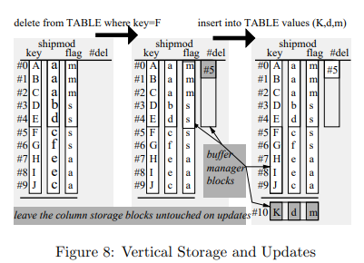

# OLAP

## How Query Engines Work

<center>
  
  <br>
</center>

<center>
  
  <br>
</center>

生成的Logical Plan首先经过Query Optimizer优化。主要介绍Rule-Based Optimizations:

- Projection push-down:尽快过滤掉列。找到projection, filter, aggregate中需要用到的列。Scan时过滤。
- Predicate push-down:尽快过滤掉行。将fiter在join之前做。
- Eliminate Common Subexpressions
- Converting Correlated Subqueries to Joins

经过优化后通过Query Planner转换为Physical Plan。

并行查询执行：

- Combining Results: Map Reduce
- Smarter Partitioning: 负载均衡需要考虑。可以把文件放在目录中，并使用kv对组成的目录名称指定内容。这样可以更早的实现谓词下推，这种方法又叫做"partition pruning".

分布式查询执行：

- Joins：必须首先在连接键上对两个表重新分区，并把分区写入磁盘。
- 需要一个查询调度程序：
  - 生成分布式的Query Plan
  - 序列化Query Plan
  - 序列化数据
  - 选择通信协议
  - 优化

------

## MonetDB/X100:

Motivations: Database systems tend to achieve only low IPC (instructions-per-cycle) efficiency on modern CPUs in compute-intensive application areas like decision support, OLAP and multimedia retrieval.

```sql
SELECT l_returnflag, l_linestatus,
sum(l_quantity) AS sum_qty,
sum(l_extendedprice) AS sum_base_price,
sum(l_extendedprice * (1 - l_discount))
AS sum_disc_price,
sum(l_extendedprice * (1 - l_discount) *
(1 + l_tax)) AS sum_charge,
avg(l_quantity) AS avg_qty,
avg(l_extendedprice) AS avg_price,
avg(l_discount) AS avg_disc,
count(*) AS count_order
FROM lineitem
WHERE l_shipdate <= date ’1998-09-02’
GROUP BY l_returnflag, l_linestatus
```

对于TPC-H Query1传统数据库使用的火山模型存在以下问题：

- Highly dependent instructions
- routine call penalty

对于列存储的数据库MonetDB/MIL，有以下优势：

- Less interpretation overhead(解决上面的问题2)
- More CPU efficiency(一个是因为解决了上面的问题1，列存储可以让编译器在编译阶段知道数据布局，因此可以实现loop-pipelining，另一方面列存也可以更好的cache friendly)

但是存在以下问题：

- Full materialization penalty。（很多列数据都没用到，增大了内存带宽的消耗）

X100: A Vectorized Query Processor:

​	Goals:

- execute high-volume queries at high CPU efficiency
- be extensible to other application domains like data mining and multi-media retrieval, and achieve those same high efficiencies on extensibility code, and
- scale with the size of the lowest storage hierarchy (disk).

​	Design:

- Disk: geared towards efficient sequential data access; vertically fragmented data layout(enhanced with lightweight data compression)
- RAM: The same vertically partitioned and even compressed disk data layout is used in RAM to save space and bandwidth.
- Cache: Small (e.g. 1000 values) vertical chunks of cache-resident data items, called “vectors” are the unit of operation for X100 execution primitives; (de)compression happens on the boundary between RAM and cache; cacheconscious and fragment huge datasets efficiently into cache-chunks and perform random data access only there.
- CPU: vectorized primitives expose to the compiler that processing a tuple is independent of the previous and next tuples.

​	Query Language:

```sql
Aggr(
    Project(
        Select(
        Table(lineitem),
        < (shipdate, date(’1998-09-03’))),
    [ discountprice = *( -( flt(’1.0’), discount),
        extendedprice) ]),
[ returnflag ],
[ sum_disc_price = sum(discountprice) ])
```

<center>
  
  <br>
</center>

​	Vectorized Primitives:

- This allows it to apply aggressive loop pipelining. 
- 允许传入向量参数
- 由原子范式生成（同类型运算），map signature requests生成（单值与列计算）

​	Data Storage:

- 更新成本增加，每一列执行一次I/O: 改为增量结构(见下图，更新可以理解为删除+插入，当表的增量达到一定程度时重新整理)
- 节省内存带宽，通过数据压缩可以进一步减少。

<center>
  
  <br>
</center>	

​	Vector size impact:

- fit cache is best!
