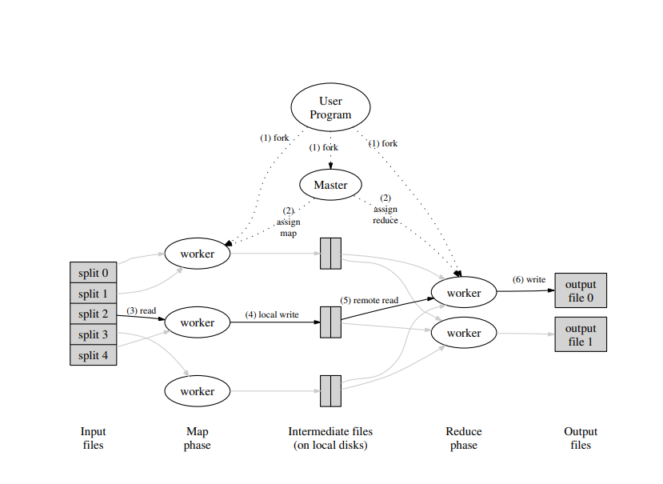
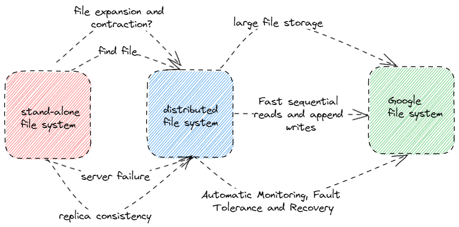
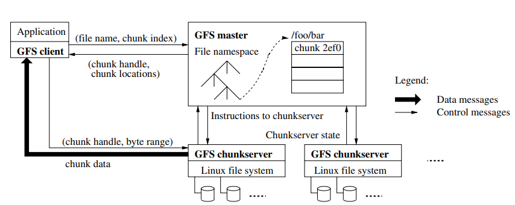
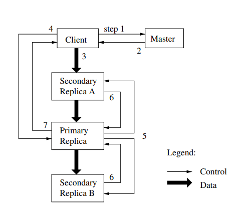
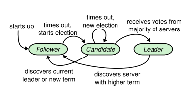
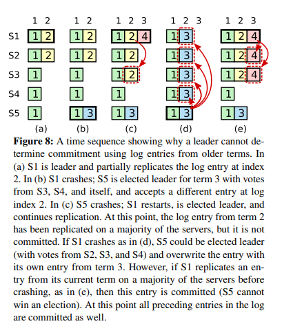
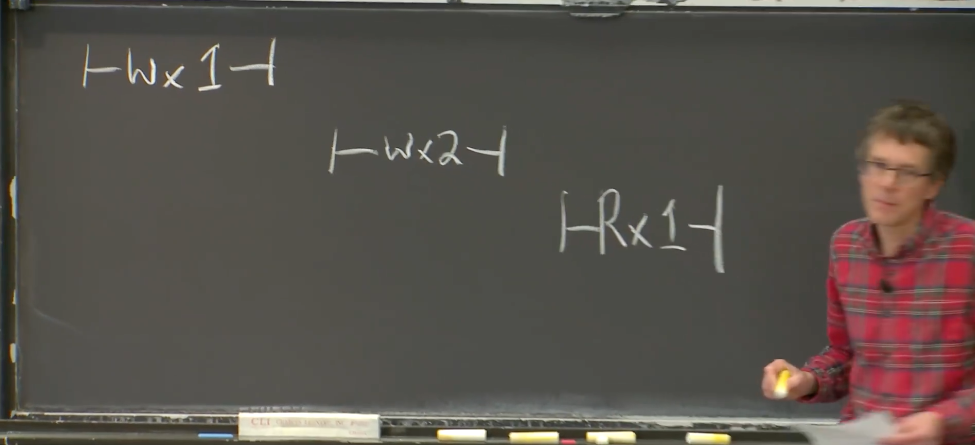
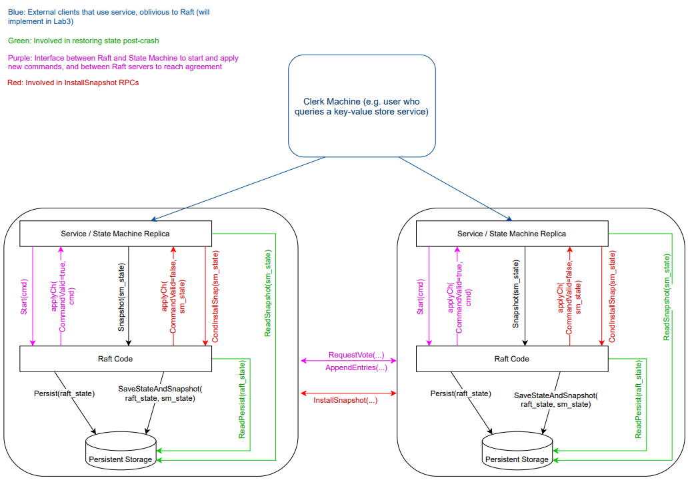

# MIT6.824

​	人们想从分布式系统中获得许多好处，比如通过并行的方式提高性能，通过复制副本的方式增加容错。但分布式系统的构建也面临很多挑战，比如更多的机器意味着故障的频率发生更高，复制副本会产生各副本之间一致性的问题等。这门课主要探究的主题包括：

- 容错：分布式系统能够自动的纠正一些错误（比如部分服务器宕机，网络延迟故障），并且具备一定的恢复故障的能力。这通常是通过在多个服务器上存储多个副本实现的。


- 一致性：当我们使用多个副本来保证系统的容错能力时，我们需要进一步考虑各副本数据之间一致性的问题。


- 性能：我们希望通过N台服务器来获得N倍的CPU并行效率，N倍的磁盘空间。但这可能会导致负载不均衡等问题。同时，性能和以上两点是矛盾的，需要根据具体业务进行合理的权衡。

------

## 	Mapreduce

​		首先通过一个例子初步感受一下分布式系统的计算过程：Mapreduce。

<center>
  
    <div>mapreduce execution overview</div>
</center>

​		Mapreduce的设计初衷是为了方便不熟悉分布式系统的程序员更好的处理数TB数据量的计算任务。它将一类的任务抽象为了Map + Reduce两个阶段。其中Map的过程类似于以下代码：

```Go
map(String key, String value):
// key: document name
// value: document contents
for each word w in value:
EmitIntermediate(w, "1");
```

​		Reduce过程类似于以下代码：

```
reduce(String key, Iterator values):
// key: a word
// values: a list of counts
int result = 0;
for each v in values:
result += ParseInt(v);
Emit(AsString(result));
```

​		举个具体的例子：词频统计任务。词频统计任务是指统计数据集中每个单词出现的次数。

- 首先系统会将整个数据集进行split操作，划分成了数个文件。


- 之后系统会对每个文件进行Map操作。对于词频统计任务来说，这里的Map操作就是遍历文件中的每个单词w，生成一个(w,1)这样的map。这样我们得到了一个类似于[(w1, 1), (w2, 1), (w3, 1), ...]的map list输出。


- Map阶段结束之后，往往会有一个shuffle的阶段，并写入到本地磁盘中，以方便后续Reduce阶段操作。在词频统计任务中，我们可以对map list中每个map的key进行哈希操作。这样根据哈希值不同，这个map list可能会被划分成map list 1, map list 2, ...我们把每一个map list i(i = 1, 2,  ...)存储到本地的一个文件中。

  

- 当所有的文件都完成Map操作之后，我们再将所有哈希值相同的map list i进行Reduce操作，比如在词频统计任务中，我们将相同哈希值的map list i 进行合并并按key进行排序。之后我们将具有相同key的map的value求和得到一个新的map list, 并写入到磁盘中，就能得到完成词频统计的任务。

​		当不熟悉分布式的程序员处理类似任务时，他只需要将任务拆分成Map任务+Reduce任务并定义好Map函数和Reduce函数传入系统，系统就会帮助他以分布式的形式完成这个任务。具体来说，MapReduce中存在两种类型的机器: Master和worker。其中Master负责将map和reduce任务分配给worker，而worker负责具体执行Map和Reduce任务。

​	这样设计的系统可能需要考虑以下问题:

- Master和worker的协作方式: 采用RPC的方式实现。这样的方式的特点是当机器A上的进程想要运行一个函数f(x,y)，机器A并不使用自身的资源去运行函数f(x,y)，而是将函数名，传入参数的引用以及返回值的引用传递给机器A上的stub，通过网络，机器A上的stub将这些消息传递给了机器B上的stub，机器B上的stub会调用本地的方法得到返回值，并把返回值传递回机器A上的stub，进一步由机器A上的stub返回给机器A上的进程。


- 保证写文件的过程是原子的：一个小trick，可以先写到临时文件中，写操作完成后通过重命名完成写文件的原子性。


- worker宕机处理：一般的做法是Master启动一个后台程序定时检查已分配任务的状态，如果任务分配之后指定时间内没有完成，需要将该任务进行重新分配。更好的做法是当worker询问新任务时，如果发现所有任务都已经分配的情况下进行检查。这样的做法一定是正确的，因为即使Master定期检查到部分任务出现故障，也要等worker询问新任务才会重新分配出去。

​	除此之外，我个人还有以下思考问题：

- **具体来说，什么样的任务可以分解为Map + Reduce的形式?还有其他适用于分布式的分解形式嘛?**


- **Master的容错应该如何保证?**


- **如果Reduce过程不要求一定要在Map过程全部完成后就开始，需要考虑哪些细节?**

​	

------

## GFS

​	以下内容来自于[戎米的论文笔记](https://www.bilibili.com/video/BV1fT411c7y6?vd_source=97ac3eaed2a0c7a9d639b4a2cb7028a9)

​	文件系统是用于存储文件，并进行读取等操作的系统。分布式系统需要依赖底层的文件系统管理所有需要持久化的文件。GFS是最著名的分布式文件系统，是分布式系统正式开始大规模商用的奠基之作。

<center>
  
    <div>Evolution of the file system</div>
</center>

​	如图所示，GFS相比于单机文件系统，存在以下新的问题:

- 在多台机器上文件的扩缩容
- 多台机器上读取文件
- 服务器故障文件不损坏不丢失
- 复制样本的一致性
- 大文件存储
- 自动监控，容错，恢复
- 快速的顺序读和追加写

<center>
  
    <div>GFS Architecture</div>
</center>

​	

​		如图所示，GFS中会存在三种节点:client, master, chunkserver。其中client负责维持专用接口，和应用直接交互。master负责维持文件的元数据， 管理文件的存储以及租约。chunkserver用于存储数据。

​	文件存储: GFS会把文件切分成一个一个的chunk进行存储，这样地址不连续的存储很方便文件的扩缩容，同时也方便各chunkserver的均衡。同时考虑到GFS需要支持大文件存储，因此chunk的大小设置为64MB这样一个偏大的值。这样做有以下好处:

- 可以有效减少系统内部的寻址和交互次数。


- 除此之外，大的chunk以为着client可能在一个chunk上执行多次操作，这样可以复用TCP连接，节省网络开销（也会带来热点问题，牺牲掉了部分性能）。


- 当然，更大的chunk意味着更少的chunk数量。这对GFS非常重要，因为master只有一台机器，更少的chunk数量节省了元数据的存储开销，相当于节省了系统内最珍贵的内存资源。

​		Master: Master主要维护两张表。一张是文件名与chunk id的映射关系，以及chunk id和chunkserver的映射关系。实际上，我们只需要对第一张表进行持久化即可，第二张表的信息可以在master开机之后从各个chunkserver处重新收集。因此，通过Master我们就能准确找到我们需要读取的文件的位置。由于GFS采用单Master的设计（实现难度低，强一致性），因此GFS需要一系列的设计来确保master不会成为整个系统的瓶颈:

- 数据流都不经过master，而是由client直接与chunkserver交互


- client会缓存master的元数据


- 增大chunk大小，压缩元数据


​	**Master的高可用设计:**

- 持久化文件名和chunk id的映射关系


- shadow master作为备份


- 所有的写数据之前都要记录日志(WAL)


- 向shadow master同步WAL

​		如果发生Master宕机，通过Chubby进行切换shadow master

​	**chunkserver的高可用设计:**

- 每个chunk会有三个副本，存储在不同的chunkserver中


- 对一个chunk的写入必须保证三个副本都已写入才算写入成功，否则会重复进行一次相同的写入


- 如果有chunkserver宕机，master会在另外的chunkserver上重建副本，将副本数目维持在3个


- 读取数据时，需要通过校验和进行检查。


- Master会下放租约给某个chunk副本，租约生效期间，对这个chunk的读写由该副本负责，该副本称为primary。租约的有效期为60s，如果发现primary宕机了，则会在租约到期后重新指定primary（防止split brain）。


- Master会选择资源利用率较低，最近创建活动较少，与其他副本不在同一机架上的chunkserver创建新副本。

​			**GFS读写流程:**

​			写入过程: Client和Master进行交互获取文件位置，之后会按距离的拓扑顺序将数据推送到各个副本中。确保所有的数据推送完成后，会向Primary发起写入请求，Primary会按一定的顺序将数据写入，并让其他副本也按照这一顺序进行写入。如果所有的副本都写入成功，则通知Client写入完成，否则会让Client重新推送一次数据，进行后续同样的操作。

<center>
  
    <div>GFS Write Flow</div>
</center>

​			如果涉及多个chunk，则分多次进行以上操作，确保每次操作仅写入一个chunk。

​		读取流程: Client首先查看cache中有无文件的元数据，如果没有则和Master交互获取文件位置，然后client和离自身最近的副本发送读请求，如果通过校验和确认则读取完成，否则读取其他副本，直到通过校验和。

​	GFS的一致性模型:

<center>
  
    <div>GFS Consistency Model</div>
</center>

​	这里解释一下defined 与consistent的差别在于，defined保证读取最新的写入是一致的。而consistent不保证最新写入的数据一致。

------

## VMware FT

​	背景：当我们构建一个服务时，计算机硬件，网络都有可能发生故障。但是我们仍然希望能够稳定的提供服务。一个可行的办法是：复制。

​	复制的限制：复制能够解决单台计算机的fail-stop故障。fail-stop故障是指当计算机出现故障时，那么它会单纯的停止运行。但是复制无法解决软件中的bug和硬件设计中的缺陷。并且复制的副本之间的错误需要是相互独立的，如果他们之间的错误是有关联的，那么复制对我们就没有帮助。除此之外，复制需要更高昂的成本，这往往取决于单个副本失效会对你造成多大的损失和不便。

​	常见的复制方法包括两种: State Transfer和Replicated State Machine。State Transfer背后的思想是Primary定期将自己完整的状态，比如内存中的内容，拷贝并发送给Backup。Backup会保存收到的最后一次的状态。复制状态机则假定某一状态在接受到相同的外部输入时会转换到确定的下一个状态。因此，Primary只需要定期将外部事件发送给Backup，Primary和Backup就能保持相同的状态。State Transfer的好处在于不需要更多的假设，更为简单的保证了副本之间的一致性。而复制状态机的好处在于，外部事件往往比服务的状态要小，可以提升复制的性能。

​	复制状态机设计的主要问题：

- 状态的定义
- Primary与Backup之间的同步频率
- Primary发生故障时的切换方案
- 当有副本发生故障时，如何维持我们需要的副本数量

​	状态定义：VMware FT会复制机器的完整状态，这包括了所有的内存，寄存器等所有信息。优点在于对于VMware FT管理的机器上的所有软件都具备了容错性。缺点是，它没有那么的高效。

​	切换方案：

- Primary宕机:当Backup一段时间没有收到Primary的消息时，Backup将会Go alive，不再受来自于Primary的事件驱动，而是自由执行。Backup会在网络中发送消息，让后续的客户端请求发往Backup，而不是Primary。


- Backup宕机:Primary如果一段时间没有收到Backup的消息，则会抛弃Backup停止向它发送事件。


- 避免重复输出：这里可以通过TCP意外的解决异常的场景。

​	非确定性事件：当一个状态在接受到相同的外部输入时，有可能会转换到不同的状态中。包括网络数据包产生中断的时间，奇怪的指令（包括随机数生成，获取当前时间，获取计算机MAC地址等），多CPU的并发。非确定性时间只能通过状态转移的方法保持一致性。

​	输出控制：Primary必须保证Backup的确认收到了Log,才能对客户端进行回复。（对性能造成了很严重的限制。有趣的几个想法：Primary指令执行和与Backup通信同时进行；输入送到Primary,输出从Backup送出）

​	Test-and-Set：为了解决因为网络故障而导致的脑裂，需要一个第三方权威机构对Backup的上线进行认证。

------

## RAFT

​	背景：在我们目前了解的Mapreduce, GFS, VMware FT三个系统中，都有着一个共同的特性，那就是他们需要由一个单节点来决定在多个副本中的Primary。使用单个节点可以让问题更加简单（比如不会脑裂），但缺点是它本身又是一个单点故障。RAFT是共识算法的一种，使用共识算法的目的在于实现复制状态机，保证多副本命令序列的一致，从而保持他们的状态一致。RAFT通过过半票决(Majority vote)的方式避免了单节点决策以及脑裂的问题，同时能够自动完成故障情况下的切换。这里过半票决指的是，系统在任何时候为了完成任何操作，都必须凑够过半的服务器来批准相应的操作。

​	**选主：**在多副本系统中，我们需要一个主副本来应答客户端的请求。在之前的系统中，这往往是由一个单点控制的。而在RAFT中，这是由整个RAFT节点集群决定的。如下图所示，当系统开机时，所有的RAFT节点都处于一个follower的状态，可以认为他们都是备选副本。当一个节点长时间没有收到leader（保存主副本的节点）的消息时，他们会发起选举，推任自己为candidate，并向其他节点请求选票。如果他们的请求获取了大部分节点的同意，那么它将成为leader。否则如果有其他节点当选，那么它会收到Leader的消息，它会变回follower。如果没有其他节点当选，那么它会再次等待一段时间，并将重新发起选举。

<center>
  
    <div>RAFT STATES</div>
</center>

​		关于这一部分，我们可能会有以下问题：

- **如何避免脑裂？**

​		RAFT中每个节点都保存了任期信息currentTerm，这个信息从0开始，并且单调递增。每当一个节点发起一次选举，他会认为当前任期的leader已经失效，那么他会自增currentTerm，去竞选下一个任期的leader。当多个condidate同时竞选leader时，其他节点会选出任期最高的节点做leader，如果任期最高的节点不止一个，则会按收到请求投票的顺序投票给时间最早的candidate，并且会更新自身的任期与任期最高的节点保持一致。同时，如果candidate知道有任期比自己高的节点存在，那么candidate就会转变为follower,并且同步最新的任期。这就保证了**只有最高任期内拥有过半投票的candidate才会竞选成为leader**，从而避免了脑裂问题。

- **如何避免活锁？**

​		RAFT选主过程还会面临活锁的问题，特别是在网络不可信赖的情况下。第一个设计在于，follower不是在固定时间内没收到leader消息而发起选举的。这个超时时间往往是一个区间内的随机数，论文中推荐的时间是150-300ms（实际上不一定）。但这还不够，我们看个例子：在一个三个节点的RAFT系统中，0号节点发起超时选举，1号节点投票给了0号。在0号节点当选leader并发送心跳信息给1号之前，1号节点也发起了超时选举。之后0号成为leader，发送心跳消息之前，收到了1号的投票请求并投票给了1号，0号又变为了follower。在下次1号发送心跳消息之前，0号又发起超时选举，这样周而复始就陷入了活锁的情况。解决这种情况，我认为有两个必要的设计，一个在于**broadcastTime << electionTimeout** 。其中广播时间是指节点间通信的时间。需要考虑到其中部分节点已经完全通信不了，因此选举请求投票时应该保证一个最长通信时间，这需要远小于超时选举时间。亦或者不需要等所有节点完成投票，只要选票数超过一半则立刻转换为leader并开始发送心跳。第二个设计在于，**当follower完成投票后也重置选举超时时间**，不需要等到leader发送心跳。这个设计我不确定是否一定有必要，但是在保证正确性的情况下也是一种直觉上更优的设计。

​	**日志复制：**当客户端有新的请求到来时，leader会将请求存储在日志中，并与其他节点进行同步，只有当超过半数的节点复制好日志后才会提交到本地应用程序中。这里可能会有三个问题：

- 如果只有新的请求到来时，才发起日志复制。那如果上一任leader写入了新的日志，并且他复制给了部分节点（没有超过半数），之后它宕机了。这些被复制了新日志的节点当选了leader，那这条新日志不是也应该立刻与其他节点同步吗？事实上，由于没有提交到本地应用程序中，因此这并不会造成什么错误，但这可能也是一个可以优化的问题。


- 如果超过半数节点完成复制，leader提交之后宕机了。而其他节点并没有完成提交，这时切换到其他副本时，就会发现上层应用程序的状态不一致。这个问题RAFT论文中并没有给出解决的办法。我个人认为的可能的解决方式是，根据RAFT安全性章节对于选举条件的进一步限制，一定是这些复制了新日志的节点当选leader，那么如果一个新节点当选leader时，往自己的日志中塞入一条空日志，那么就会进一步引发日志复制保证了这次提交了。同时也解决了我上一个提到的问题。


- **如何保证主副本之间的一致性。**RAFT通过一种非常保守的方式进行一致性检查。leader首先找到follower与自己日志相同的部分，第一次找的过程通常会从leader日志最后的位置开始找，如果不匹配则往前一个位置继续去进行匹配。匹配上了之后，会比较follower日志的后部分与leader想要同步的新日志（当网络不可靠时，可能会有一些老日志想要发起同步，这时不能直接截断），当出现第一个冲突的地方时，直接截断follower后部分日志，并把新日志写入follower中。之后leader就会从与该follower最新一次同步的日志的最后位置开始去匹配。这个过程首先听上去可以优化的点在于匹配的过程，一个一个往前找在某些情况下可能会有很大的性能损失。但我个人觉得，加入日志快照功能之后，这里的优化必要性不大。另一个问题在于，日志不能乱序存放，这当然会损失掉一些性能。但是RAFT本身的目的在于实现一个简单易懂的共识算法，因此这里选择了非常保守的策略。

​	**安全性：**安全性主要是对选主和日志复制过程中的corner case进行修正。首先是选举限制，即Leader不仅需要是最高任期同时还需要拥有最新的日志。这里最新的日志是指，最后一条日志的任期是所有副本所有日志中最大的，如果有相同的任期的其他日志，那么这条日志存储的位置的索引是最大的（日志是按顺序存储的）。这主要是防止某台机器宕机很久，然后重新连入集群中，变为leader将其他节点的日志都覆盖掉。然后是对日志提交提出了新的要求，提交的最后一个日志不仅需要大多数节点同意，同时必须是当前任期的。否则就会出现下图的情况：

<center>
  
    <div>RAFT FIGURE8</div>
</center>

​	**集群成员变更：**待补充...

------

## Linearizability

以下内容参考了[线性一致性](https://zhuanlan.zhihu.com/p/42239873)与[mit6.824翻译](https://mit-public-courses-cn-translatio.gitbook.io/mit6-824/lecture-08-zookeeper/8.3-xian-xing-yi-zhi-linearizability3)

​	问题的提出：当一个多副本的服务或任意其他的服务正确运行意味着什么？

​	我们对于正确的定义就是Linearizability 线性一致或者说Strong consistency强一致。直觉上来说，一个服务是线性一致的，那么它的表现的就像只有一个服务器，并且服务器没有故障，这个服务器每次执行一个客户端请求。更准确地说，一个系统的执行历史是一系列的客户端请求，如果执行历史整体可以按照一个顺序排列，且排列顺序与客户端请求的实际时间相符合，那么它就是线性一致的。

​	对于客户端的一系列请求op1, op2, op3, ... , 对应的请求有一个客户端发出的时间send1, send2, send3, ... , 对应的服务端的回复时间reply1, reply2, reply3, ...。要达到线性一致，我们需要确定请求的排列顺序。这样的排列顺序需要满足:

- 如果reply i > send j, 那么我们连一条i 到j 的有向边，表示请求i 在请求j 之前。


- 如果 op j 为读， 并且它读到了key k对应的value v， 那么一定存在一个请求op i为写，写入内容是将key k对应的value修改为v。我们连一条i到j的有向边，表示请求i在请求j之前。

​	几个不是线性一致的例子：

<center>
  
    <div>线性不一致 Ex1</div>
</center>

​	这个例子给我们的教训是：对于系统执行写请求，只能有一个顺序，所有客户端读到的数据的顺序，必须与系统执行写请求的顺序一致。

<center>
  
    <div>线性不一致 Ex2</div>
</center>

​	这个例子给我们的教训是：对于读请求不允许返回旧的数据，只能返回最新的数据。

​	下面是Lab3的kv raft的架构图：

<center>
  
    <div>raft diagram</div>
</center>

这里我们主要考虑在保证线性一致的情况下一些可能的优化：

​	首先，Get请求不需要传入Raft层进行共识，因为Get请求并不会改变状态。但是需要额外的操作，否则当出现网络分区的情况时，会发生线性不一致的情况。

- ReadIndex: 首先，leader必须返回最新的committed index，因此在leader当选时需要提交一个空日志（所以上一节我在日志复制章节里的想法是正确的），然后再进行read。其次读操作时，需要发送心跳确认自己的leader身份（防止网络分区）。


- lease read: 通过lease机制维护Leader的状态，减少ReadIndex每次read发送心跳的开销（这里必须保证租约的时间小于选举超时时间，这样租约期间只有一个leader）。实际上还能甚至不必等到ReadIndex apply，服务端可以直接返回读请求，这样也是满足线性一致性的。但同时需要注意，由于新Leader可能落后于老Leader，因此只有在Leader的状态机应用了当前term的第一个Log之后才能LeaseRead。


- follower read：先去 Leader 查询最新的 committed index，然后拿着 committed Index 去 Follower read，从而保证能从 Follower 中读到最新的数据。这个优化明显是最好的，因为他将leader的部分工作负载分担给了follower。

------

## Zookeeper

​	问题的提出：Raft实际上是一个库，并不能直接提供可以交互的独立的服务，同时我们也知道要实现一个线性一致的基于RAFT的服务还需要花费额外的努力。因此，Zookeeper旨在能够提供一个通用的协调服务帮助构建分布式应用。

​	一致性保证：我们知道通过RAFT + follower read可以实现线性一致性。但同时在Read的过程中，还是需要花费一次和Leader通信的开销。Zookeeper为了减少这样的开销，而放弃了线性一致性。即Zookeeper的客户端会直接找follower去进行数据读取。Zookeeper这里的一致性保证是写请求（包括即读又写的请求）线性一致（写入raft层log里肯定是线性一致的）和FIFO client order（即对于一个客户端来说，会按照客户端发送的顺序来执行）。由于会出现follower副本不可用的情况，因此客户端会记录最后的读请求对应的applyIndex。对于后续的读请求必须不晚于这个applyIndex。（这里的applyIndex是我的理解）。

​	线性一致性：如果想要做到线性一致性，可以使用sync操作，原理是在读操作之前发送一个空的写请求，以保证读操作能读到最新的数据。（本质上我的理解就相当于把读操作写入log了，估计现在的版本已经优化了）。

​	更具体的来说，Zookeeper可以解决大的数据中心单点失效的问题，比如MapReduce,  GFS中的Master， VMware FT中的TEST-AND-SET。这是Zookeeper设计API时一些具体的动机。同时，为了让一个Zookeeper集群能够运行多个服务，Zookeeper将API设计成了一个层级化的目录结构。这些目录和文件被称为znodes。

​	znodes: Zookper设计了三种znodes。包括Regular znodes，这种znode一旦创建，就永远存在，除非主动删除。第二种叫Ephemeral znodes，如果Zookeeper认为创建它的客户端挂了，它会删除这种类型的znodes。最后一种叫Sequential znodes，当多个客户端同时想以特定名字创建文件时，会在文件名之后加一个数字，并且保证数字不重合，且一定是递增的。

​	API: Zookper以RPC的方式暴露以下API:

- CREATE(PATH, DATA, FLAG)：PATH为文件路径，DATA为数据，FLAG为znode类型。当存在该文件时，会返回FASLE，否则会创建文件，返回TRUE。
- DELETE(PATH, VERSION): VERSION为版本号，每个znode都会有一个版本号，当znode有更新时，version也会随之增加。表示要删除某个版本的文件。
- EXIST(PATH, WATCH)：WATCH可以监听文件的变化，当文件有任何变更都会通知客户端。表示某个文件是否存在。
- GETDATA(PATH, WATCH)。
- SETDATA(PATH, DATA, VERSION)
- LIST(PATH)。返回路径下所有文件。

​	一些应用(Zookeeper只能保证一些简单事务的原子性，称之为mini-transaction)：

​	计数器：

```
WHILE TRUE:
    X, V = GETDATA("F")
    IF SETDATA("f", X + 1, V):
        BREAK
```

​		Non-Scalable Lock：

```
WHILE TRUE:
    IF CREATE("f", data, ephemeral=TRUE): RETURN
    IF EXIST("f", watch=TRUE):
        WAIT
```

​		这种锁和上一个计数器都有羊群效应，复杂度为O(n^2)

​		Scalable Lock:

```
CREATE("f", data, sequential=TRUE, ephemeral=TRUE)
WHILE TRUE:
    LIST("f*")
    IF NO LOWER #FILE: RETURN
    IF EXIST(NEXT LOWER #FILE, watch=TRUE):
        WAIT
```

------

## CRAQ

​	背景：CRAQ是对于CR的一种旧方案的改进，但是CRAQ实现了将读请求分发到任意副本执行并能够保证线性一致性。

​	CR：在CR系统中，服务器按链排列，第一个服务器称为HEAD，最后一个称为TAIL。当客户端发送一个写请求，写请求总是先送到HEAD，HEAD会先在本地apply之后再将写请求通过链传向下一个服务器，以此类推，直到写请求传到TAIL，TAIL apply之后会回复客户端。对于读请求，客户端会发往TAIL。当没有故障的时候，整个系统就像只有TAIL一台机器一样 ，因此CR是线性一致的。当某个节点出现故障时，基本上只要将故障节点从链中移除即可。

​	Why CR: CR相比于RAFT来说，拥有更好的性能，这时因为当客户端请求变多时，RAFT leader很容易会成为bottle neck，而CR则会有HEAD和TAIL分担请求并且HEAD只用将请求发送给下一个节点而不是其他所有节点，因此bottle neck会来的更晚一些。除此之外，CR的故障恢复也更容易。

​	CR drawback: CR无法处理网络分区的问题，当HEAD和第二个节点的网络连接出现问题时，会出现脑裂现象。因此CR并不是一个完整的复制方案，需要一个第三方的权威机构Configuration Manager去决定一条链的节点组成。CRAQ基于Zookeeper构建了Configuration Manager。（实际上还是不能解决HEAD和第二个节点无法通信的问题，需要更多的细节来设计Configuration Manager）

​	CRAQ进一步构建一个更高效的系统：实现数据分片，每个分片可以是一条链(不一定是链，使用CR或是RAFT还是其他的共识算法，取决于你的场景。比如RAFT会受到Leader的限制，而CR也会受到链上最慢的服务器的限制)，每个链都可以构建极其高效的结构存储数据，进而进一步加大并发的读写请求。同时，也不会出现网络分区问题，因为这些链会由一个可靠的，不会脑裂的Configuration Manager管理。

------

## Aurora

​	
