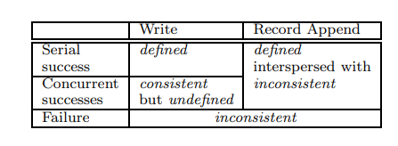

# MIT6.824

​	人们想从分布式系统中获得许多好处，比如通过并行的方式提高性能，通过复制副本的方式增加容错。但分布式系统的构建也面临很多挑战，比如更多的机器意味着故障的频率发生更高，复制副本会产生各副本之间一致性的问题等。这门课主要探究的主题包括：

- 容错：分布式系统能够自动的纠正一些错误（比如部分服务器宕机，网络延迟故障），并且具备一定的恢复故障的能力。这通常是通过在多个服务器上存储多个副本实现的。


- 一致性：当我们使用多个副本来保证系统的容错能力时，我们需要进一步考虑各副本数据之间一致性的问题。


- 性能：我们希望通过N台服务器来获得N倍的CPU并行效率，N倍的磁盘空间。但这可能会导致负载不均衡等问题。同时，性能和以上两点是矛盾的，需要根据具体业务进行合理的权衡。

------

## 	Mapreduce

​		首先通过一个例子初步感受一下分布式系统的计算过程：Mapreduce。

<center>
  
    <div>mapreduce execution overview</div>
</center>

​		Mapreduce的设计初衷是为了方便不熟悉分布式系统的程序员更好的处理数TB数据量的计算任务。它将一类的任务抽象为了Map + Reduce两个阶段。其中Map的过程类似于以下代码：

```Go
map(String key, String value):
// key: document name
// value: document contents
for each word w in value:
EmitIntermediate(w, "1");
```

​		Reduce过程类似于以下代码：

```
reduce(String key, Iterator values):
// key: a word
// values: a list of counts
int result = 0;
for each v in values:
result += ParseInt(v);
Emit(AsString(result));
```

​		举个具体的例子：词频统计任务。词频统计任务是指统计数据集中每个单词出现的次数。

- 首先系统会将整个数据集进行split操作，划分成了数个文件。


- 之后系统会对每个文件进行Map操作。对于词频统计任务来说，这里的Map操作就是遍历文件中的每个单词w，生成一个(w,1)这样的map。这样我们得到了一个类似于[(w1, 1), (w2, 1), (w3, 1), ...]的map list输出。


- Map阶段结束之后，往往会有一个shuffle的阶段，并写入到本地磁盘中，以方便后续Reduce阶段操作。在词频统计任务中，我们可以对map list中每个map的key进行哈希操作。这样根据哈希值不同，这个map list可能会被划分成map list 1, map list 2, ...我们把每一个map list i(i = 1, 2,  ...)存储到本地的一个文件中。

  

- 当所有的文件都完成Map操作之后，我们再将所有哈希值相同的map list i进行Reduce操作，比如在词频统计任务中，我们将相同哈希值的map list i 进行合并并按key进行排序。之后我们将具有相同key的map的value求和得到一个新的map list, 并写入到磁盘中，就能得到完成词频统计的任务。

​		当不熟悉分布式的程序员处理类似任务时，他只需要将任务拆分成Map任务+Reduce任务并定义好Map函数和Reduce函数传入系统，系统就会帮助他以分布式的形式完成这个任务。具体来说，MapReduce中存在两种类型的机器: Master和worker。其中Master负责将map和reduce任务分配给worker，而worker负责具体执行Map和Reduce任务。

​	这样设计的系统可能需要考虑以下问题:

- Master和worker的协作方式: 采用RPC的方式实现。这样的方式的特点是当机器A上的进程想要运行一个函数f(x,y)，机器A并不使用自身的资源去运行函数f(x,y)，而是将函数名，传入参数的引用以及返回值的引用传递给机器A上的stub，通过网络，机器A上的stub将这些消息传递给了机器B上的stub，机器B上的stub会调用本地的方法得到返回值，并把返回值传递回机器A上的stub，进一步由机器A上的stub返回给机器A上的进程。


- 保证写文件的过程是原子的：一个小trick，可以先写到临时文件中，写操作完成后通过重命名完成写文件的原子性。


- worker宕机处理：一般的做法是Master启动一个后台程序定时检查已分配任务的状态，如果任务分配之后指定时间内没有完成，需要将该任务进行重新分配。更好的做法是当worker询问新任务时，如果发现所有任务都已经分配的情况下进行检查。这样的做法一定是正确的，因为即使Master定期检查到部分任务出现故障，也要等worker询问新任务才会重新分配出去。

​	除此之外，我个人还有以下思考问题：

- **具体来说，什么样的任务可以分解为Map + Reduce的形式?还有其他适用于分布式的分解形式嘛?**


- **Master的容错应该如何保证?**


- **如果Reduce过程不要求一定要在Map过程全部完成后就开始，需要考虑哪些细节?**

​	

------

## GFS

​	以下内容来自于[戎米的论文笔记](https://www.bilibili.com/video/BV1fT411c7y6?vd_source=97ac3eaed2a0c7a9d639b4a2cb7028a9)

​	文件系统是用于存储文件，并进行读取等操作的系统。分布式系统需要依赖底层的文件系统管理所有需要持久化的文件。GFS是最著名的分布式文件系统，是分布式系统正式开始大规模商用的奠基之作。

<center>
  
    <div>Evolution of the file system</div>
</center>

​	如图所示，GFS相比于单机文件系统，存在以下新的问题:

- 在多台机器上文件的扩缩容
- 多台机器上读取文件
- 服务器故障文件不损坏不丢失
- 复制样本的一致性
- 大文件存储
- 自动监控，容错，恢复
- 快速的顺序读和追加写

<center>
  
    <div>GFS Architecture</div>
</center>

​	

​		如图所示，GFS中会存在三种节点:client, master, chunkserver。其中client负责维持专用接口，和应用直接交互。master负责维持文件的元数据， 管理文件的存储以及租约。chunkserver用于存储数据。

​	文件存储: GFS会把文件切分成一个一个的chunk进行存储，这样地址不连续的存储很方便文件的扩缩容，同时也方便各chunkserver的均衡。同时考虑到GFS需要支持大文件存储，因此chunk的大小设置为64MB这样一个偏大的值。这样做有以下好处:

- 可以有效减少系统内部的寻址和交互次数。


- 除此之外，大的chunk以为着client可能在一个chunk上执行多次操作，这样可以复用TCP连接，节省网络开销（也会带来热点问题，牺牲掉了部分性能）。


- 当然，更大的chunk意味着更少的chunk数量。这对GFS非常重要，因为master只有一台机器，更少的chunk数量节省了元数据的存储开销，相当于节省了系统内最珍贵的内存资源。

​		Master: Master主要维护两张表。一张是文件名与chunk id的映射关系，以及chunk id和chunkserver的映射关系。实际上，我们只需要对第一张表进行持久化即可，第二张表的信息可以在master开机之后从各个chunkserver处重新收集。因此，通过Master我们就能准确找到我们需要读取的文件的位置。由于GFS采用单Master的设计（实现难度低，强一致性），因此GFS需要一系列的设计来确保master不会成为整个系统的瓶颈:

- 数据流都不经过master，而是由client直接与chunkserver交互


- client会缓存master的元数据


- 增大chunk大小，压缩元数据


​	**Master的高可用设计:**

- 持久化文件名和chunk id的映射关系


- shadow master作为备份


- 所有的写数据之前都要记录日志(WAL)


- 向shadow master同步WAL

​		如果发生Master宕机，通过Chubby进行切换shadow master

​	**chunkserver的高可用设计:**

- 每个chunk会有三个副本，存储在不同的chunkserver中


- 对一个chunk的写入必须保证三个副本都已写入才算写入成功，否则会重复进行一次相同的写入


- 如果有chunkserver宕机，master会在另外的chunkserver上重建副本，将副本数目维持在3个


- 读取数据时，需要通过校验和进行检查。


- Master会下放租约给某个chunk副本，租约生效期间，对这个chunk的读写由该副本负责，该副本称为primary。租约的有效期为60s，如果发现primary宕机了，则会在租约到期后重新指定primary（防止split brain）。


- Master会选择资源利用率较低，最近创建活动较少，与其他副本不在同一机架上的chunkserver创建新副本。

​			**GFS读写流程:**

​			写入过程: Client和Master进行交互获取文件位置，之后会按距离的拓扑顺序将数据推送到各个副本中。确保所有的数据推送完成后，会向Primary发起写入请求，Primary会按一定的顺序将数据写入，并让其他副本也按照这一顺序进行写入。如果所有的副本都写入成功，则通知Client写入完成，否则会让Client重新推送一次数据，进行后续同样的操作。

<center>
  
    <div>GFS Write Flow</div>
</center>

​			如果涉及多个chunk，则分多次进行以上操作，确保每次操作仅写入一个chunk。

​		读取流程: Client首先查看cache中有无文件的元数据，如果没有则和Master交互获取文件位置，然后client和离自身最近的副本发送读请求，如果通过校验和确认则读取完成，否则读取其他副本，直到通过校验和。

​	GFS的一致性模型:

<center>
  
    <div>GFS Consistency Model</div>
</center>

​	这里解释一下defined 与consistent的差别在于，defined保证读取最新的写入是一致的。而consistent不保证最新写入的数据一致。

------

## VMware FT

​	背景：当我们构建一个服务时，计算机硬件，网络都有可能发生故障。但是我们仍然希望能够稳定的提供服务。一个可行的办法是：复制。

​	复制的限制：复制能够解决单台计算机的fail-stop故障。fail-stop故障是指当计算机出现故障时，那么它会单纯的停止运行。但是复制无法解决软件中的bug和硬件设计中的缺陷。并且复制的副本之间的错误需要是相互独立的，如果他们之间的错误是有关联的，那么复制对我们就没有帮助。除此之外，复制需要更高昂的成本，这往往取决于单个副本失效会对你造成多大的损失和不便。

​	常见的复制方法包括两种: State Transfer和Replicated State Machine。State Transfer背后的思想是Primary定期将自己完整的状态，比如内存中的内容，拷贝并发送给Backup。Backup会保存收到的最后一次的状态。复制状态机则假定某一状态在接受到相同的外部输入时会转换到确定的下一个状态。因此，Primary只需要定期将外部事件发送给Backup，Primary和Backup就能保持相同的状态。State Transfer的好处在于不需要更多的假设，更为简单的保证了副本之间的一致性。而复制状态机的好处在于，外部事件往往比服务的状态要小，可以提升复制的性能。

​	复制状态机设计的主要问题：

- 状态的定义
- Primary与Backup之间的同步频率
- Primary发生故障时的切换方案
- 当有副本发生故障时，如何维持我们需要的副本数量

​	状态定义：VMware FT会复制机器的完整状态，这包括了所有的内存，寄存器等所有信息。优点在于对于VMware FT管理的机器上的所有软件都具备了容错性。缺点是，它没有那么的高效。

​	切换方案：

- Primary宕机:当Backup一段时间没有收到Primary的消息时，Backup将会Go alive，不再受来自于Primary的事件驱动，而是自由执行。Backup会在网络中发送消息，让后续的客户端请求发往Backup，而不是Primary。


- Backup宕机:Primary如果一段时间没有收到Backup的消息，则会抛弃Backup停止向它发送事件。


- 避免重复输出：这里可以通过TCP意外的解决异常的场景。

​	非确定性事件：当一个状态在接受到相同的外部输入时，有可能会转换到不同的状态中。包括网络数据包产生中断的时间，奇怪的指令（包括随机数生成，获取当前时间，获取计算机MAC地址等），多CPU的并发。非确定性时间只能通过状态转移的方法保持一致性。

​	输出控制：Primary必须保证Backup的确认收到了Log,才能对客户端进行回复。（对性能造成了很严重的限制。有趣的几个想法：Primary指令执行和与Backup通信同时进行；输入送到Primary,输出从Backup送出）

​	Test-and-Set：为了解决因为网络故障而导致的脑裂，需要一个第三方权威机构对Backup的上线进行认证。

------

## RAFT

