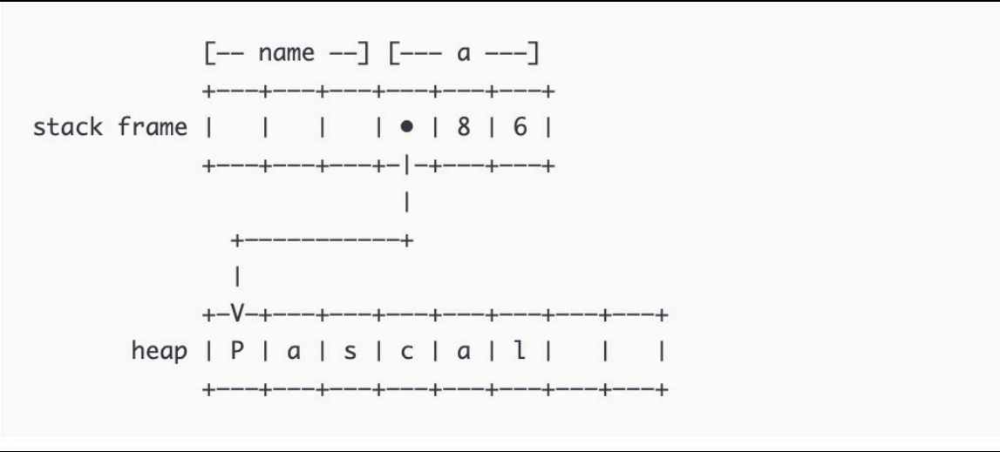
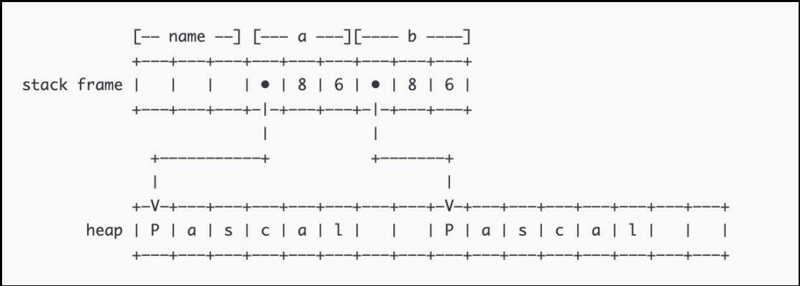

# Rust

source from [https://github.com/wubx/rust-in-databend](https://github.com/wubx/rust-in-databend)

背景：很难编写内存/线程安全的代码。Rust的期望是性能可以和 C/C++ 媲美，还能保证安全性，同时可以提供⾼ 效的开发效率，代码还得容易维护。

设计思想：安全；并发；高效；零成本抽象。

------

**所有权**

所有程序在运行时都必须管理它们使用计算机内存的方式。

```rust
fn main() {
    let name = "Pascal".to_string();
    let a = name;
    let b = name;
}
```

<center>
  
  <br>
</center>

如图所示，当把name赋值给a时会将所有权也交给a，导致let b = name报错。

```rust
fn main() {
    let name = "Pascal".to_string();
    let a = name;
    let b = a.clone();
}
```

<center>
  
  <br>
</center>

​	如图所示，使用clone会进行深拷贝。

```rust
fn main() {
    let name = "Pascal".to_string();
    let a = &name;
    let b = a; // or let b = &name;
}
```

​	可以通过&引用，而使name不丢失所有权。

------

**错误处理**

分类：可恢复（例如文件未找到，可再次尝试）/不可恢复（bug）

不可恢复的错误与panic!:

- 打印错误信息；展开并清理调用栈；退出程序
- 也可以在Cargo.toml中设置panic = 'abort'，这样不会展开清理调用栈，直接退出程序。
- 可以通过设置环境变量RUST_BACKTRACE得到回溯信息

可恢复错误与Result枚举：

- 可以通过unwrap获取ok里的值，错误时会触发panic!。也可以使用expect自定义错误信息。
- 可以通过?进行错误的传播。被?应用的错误，会隐式的被from函数处理。
- Box\<dyn Error\>是trait对象，简单理解:任何可能的错误类型。

------

**生命周期**

引用保持有效的作用域。大部分情况生命周期是隐式的，可被推断的。

目的：避免悬垂指针。

生命周期的标注：描述了多个引用生命周期的关系，但不影响生命周期。标注的生命周期的实际生命周期是所有标注的引用生命周期中最小的引用的生命周期。

什么时候需要生命周期标注：引用分为输入引用和输出引用。输入引用会自动的标注成不同的生命周期，如果只有一个输入引用或者存在self的输入引用那么输出引用的生命周期和单个的输入引用/self的输入引用相同。否则无法判断输出引用，需要自行标注输出引用和输入引用生命周期的关系。

------

**智能指针**

​	与普通引用的区别在于，当所有权拥有者超出作用范围后依然有效，智能指针可以共享所有权。

- Box\<T\>:在heap内存上分配值。使用场景：当编译时类型大小无法确定，而使用该类型时，上下文却需要知道其大小；有大量数据移交所有权且不要求复制；使用某个变量时，只关心是否实现了某个trait，而不关心具体类型。
- Rc\<T\>:启用多重所有权的引用计数类型。使用场景：需要在heap上分配数据，这些数据被多个部分读取（read-only），但在编译时无法确定哪个部分最后使用完这些数据；只适用于单线程。
- Arc\<T\>:与Rc有相同的API，并且可以安全的用于并发环境。
- Cow\<'a, B'\>:The type `Cow` is a smart pointer providing clone-on-write functionality: it can enclose and provide immutable access to borrowed data, and clone the data lazily when mutation or ownership is required.

------

**宏**

宏的目的是为了进行语法扩展。不同于C++的宏是在词法分析阶段进行展开，Rust的宏是在语法分析阶段进行展开的。

下面有一个例子，来源于[zhihu](https://zhuanlan.zhihu.com/p/342408254)

```
// C++
#define sqr(x) (x * x)

//Rust
macro_rules! sqr {
	($x:expr) => {$x * $x}
}

sqr(1 + 1)
// C++
3
// Rust
4
```

**派生宏：**

只能用于struct, enum和union。通过调用#[derive(xxx)]生效，在目标代码块下添加代码。

**函数式宏：**

实现自定义语法规则

**属性宏：**

相比于派生宏可以用于更多对象，包括函数,impl块,mod块,trait块等等。通过调用#[xxx(yyy, zzz, ...)]生效，可以替换，删除，新增代码。

------

## 无畏并发

- spawn创建新线程。使用join等待所有线程结束。通过在闭包之前增加 `move` 关键字，我们强制闭包获取其使用的值的所有权，而不是任由 Rust 推断它应该借用值。
- `Send` 标记 trait 表明实现了 `Send` 的类型值的所有权可以在线程间传送。
- `Sync` 标记 trait 表明一个实现了 `Sync` 的类型可以安全的在多个线程中拥有其值的引用。
- 通常并不需要手动实现 `Send` 和 `Sync` trait，因为由 `Send` 和 `Sync` 的类型组成的类型，自动就是 `Send` 和 `Sync` 的。因为它们是标记 trait，甚至都不需要实现任何方法。它们只是用来加强并发相关的不可变性的。

------

## 异步编程

​	通过少量线程来实现并发的编程模型。

- async/.await: async将一个代码块转化为实现了future特征的状态机。阻塞的future会把线程控制权交出，让其他Future继续执行。在`async fn`函数中， 你可以使用`.await`来等待其他实现了`Future` trait 的类型完成。

- `futures::join` 宏等待并发执行的多个不同 future 完成。

- `futures::select` 宏同时跑多个 future，允许用户在任意 future 完成时响应。

- future:Future调用Poll尽可能推进任务的完成。如果未完成，则会注册一个回调函数wake()。当Future可以进一步推进时调用wake()，驱动Future的执行器会再次Poll。

  ```rust
  pub trait Future {
      type Output;
  
      // Required method
      fn poll(self: Pin<&mut Self>, cx: &mut Context<'_>) -> Poll<Self::Output>;
  }
  
  //多Futures并发
      fn poll(&mut self, wake: fn()) -> Poll<Self::Output> {
          // Attempt to complete future `a`.
          if let Some(a) = &mut self.a {
              if let Poll::Ready(()) = a.poll(wake) {
                  self.a.take();
              }
          }
  
          // Attempt to complete future `b`.
          if let Some(b) = &mut self.b {
              if let Poll::Ready(()) = b.poll(wake) {
                  self.b.take();
              }
          }
  
          if self.a.is_none() && self.b.is_none() {
              // Both futures have completed -- we can return successfully
              Poll::Ready(())
          } else {
              // One or both futures returned `Poll::Pending` and still have
              // work to do. They will call `wake()` when progress can be made.
              Poll::Pending
          }
      }
  
  // 多Futures串行
      fn poll(&mut self, wake: fn()) -> Poll<Self::Output> {
          if let Some(first) = &mut self.first {
              match first.poll(wake) {
                  // We've completed the first future -- remove it and start on
                  // the second!
                  Poll::Ready(()) => self.first.take(),
                  // We couldn't yet complete the first future.
                  Poll::Pending => return Poll::Pending,
              };
          }
          // Now that the first future is done, attempt to complete the second.
          self.second.poll(wake)
      }
  ```

- Waker:`Waker`提供`wake()`方法来告诉执行器哪个关联任务应该要唤醒。当`wake()`函数被调用时， 执行器知道`Waker`关联的任务已经准备好继续了，并且任务的future会被轮询一遍。

  ```rust
  pub struct TimerFuture {
      shared_state: Arc<Mutex<SharedState>>,
  }
  
  struct SharedState {
      completed: bool,
      waker: Option<Waker>,
  }    
  
  fn poll(self: Pin<&mut Self>, cx: &mut Context<'_>) -> Poll<Self::Output> {
          let mut shared_state = self.shared_state.lock().unwrap();
          if shared_state.completed {
              Poll::Ready(())
          } else {
              shared_state.waker = Some(cx.waker().clone());
              Poll::Pending
          }
      }
      
  pub fn new(duration: Duration) -> Self {
          let shared_state = Arc::new(Mutex::new(SharedState {
              completed: false,
              waker: None,
          }));
  
          let thread_shared_state = shared_state.clone();
          thread::spawn(move || {
              thread::sleep(duration);
              let mut shared_state = thread_shared_state.lock().unwrap();
              shared_state.completed = true;
              if let Some(waker) = shared_state.waker.take() {
                  waker.wake()
              }
          });
  
          TimerFuture { shared_state }
      }
  ```

- Executor: `Future` 执行器会拿一组顶层 `Future` 去跑 `poll` 方法，无论这些 `Future` 能否进展。通常， 执行器会 `poll` 一个 future 实例来启动。当 `Future` 通过调用 `wake()` 方法来指示他们准备好继续 进展，执行器就会把它们放入队列并再一次 `poll`，重复这一过程直到 `Future` 完成。

总结：Executor首先把所有future按顺序poll一遍，然后没完成的future会让waker注册一个回调函数wake。wake函数通过IO感知系统阻塞原件了解到future可以进一步进展时，则会通知Executor进一步去poll该future。

- async生命周期：`async fn` 会获取引用以及其他拥有非 `'static` 生命周期的参数。这意味着这些 future 被 `async fn` 函数返回后必须要在它的非 `'static` 参数仍然有效时 `.await`。

```rust
fn bad() -> impl Future<Output = u8> {
    let x = 5;
    borrow_x(&x) // ERROR: `x` does not live long enough
}

fn good() -> impl Future<Output = u8> {
    async {
        let x = 5;
        borrow_x(&x).await
    }
}
```

- async move: 一个 `async move` 块会获取 所指向变量的所有权，允许它的生命周期超过当前作用域(outlive)，但是放弃了与其他代码共享这些变量的能力.
- Pinning:`Pin` 类型包装了指针类型, 保证没有实现 `Unpin` 指针指向的值不会被移动。如果 `T: Unpin`（默认会实现），那么 `Pin<'a, T>` 完全等价于 `&'a mut T`。
- Stream trait: `Stream` trait 与 `Future` 类似，但能在完成前返还（yield）多个值。

------

## Tokio

source from [here](https://github.com/sunface/tokio-course)

- async main与\#[tokio::main]。`.await` 只能在 `async` 函数中使用，如果是以前的 `fn main`，那它内部是无法直接使用 `async` 函数的！这个会极大的限制了我们的使用场景。异步运行时本身需要初始化。

  ```rust
  #[tokio::main]
  async fn main() {
      println!("hello");
  }
  
  // =>
  fn main() {
      let mut rt = tokio::runtime::Runtime::new().unwrap();
      rt.block_on(async {
          println!("hello");
      })
  }
  ```

- tokio::net::TcpListener 接收sockets

- tokio::spawn 生成一个新的Tokio任务（异步的绿色线程）。spawn函数会返回一个 `JoinHandle` 类型的句柄，调用者可以使用该句柄跟创建的任务进行交互。当使用 Tokio 创建一个任务时，该任务类型的生命周期必须是 `'static`。意味着，在任务中不能使用外部数据的引用。Tokio任务必须实现 `Send` 特征，因为当这些任务在 `.await` 执行过程中发生阻塞时，Tokio 调度器会将任务在线程间移动。

- std::sync::Mutex 与 tokio::sync::Mutex。锁如果在多个 `.await` 过程中持有，应该使用 Tokio 提供的锁，原因是 `.await`的过程中锁可能在线程间转移，若使用标准库的同步锁存在死锁的可能性，例如某个任务刚获取完锁，还没使用完就因为 `.await` 让出了当前线程的所有权，结果下个任务又去获取了锁，造成死锁。锁竞争不多的情况下，使用 std::sync::Mutex。**锁竞争不仅仅会导致当前的任务被阻塞，还会导致执行任务的线程被阻塞，因此该线程准备执行的其它任务也会因此被阻塞！**当同步锁的竞争变成一个问题时，使用 Tokio 提供的异步锁几乎并不能帮你解决问题，此时可以考虑如下选项：

  - 创建专门的任务并使用消息传递的方式来管理状态
  - 将锁进行分片
  - 重构代码以避免锁

- Tokio 提供了多种消息通道，可以满足不同场景的需求:

  - [`mpsc`](https://docs.rs/tokio/1.15.0/tokio/sync/mpsc/index.html), 多生产者，单消费者模式
  - [`oneshot`](https://docs.rs/tokio/1.15.0/tokio/sync/oneshot/index.html), 单生产者单消费，一次只能发送一条消息
  - [`broadcast`](https://docs.rs/tokio/1/tokio/sync/broadcast/index.html)，多生产者，多消费者，其中每一条发送的消息都可以被所有接收者收到，因此是广播
  - [`watch`](https://docs.rs/tokio/1/tokio/sync/watch/index.html)，单生产者，多消费者，只保存一条最新的消息，因此接收者只能看到最近的一条消息，例如，这种模式适用于配置文件变化的监听
  - [`async-channel`](https://docs.rs/async-channel/latest/async_channel/)，多生产者、多消费者，且每一条消息只能被其中一个消费者接收，如果有这种需求

- AsyncRead 和 AsyncWrite: `AsyncReadExt::read` 是一个异步方法可以将数据读入缓冲区( `buffer` )中，然后返回读取的字节数。AsyncReadExt::read_to_end` 方法会从字节流中读取所有的字节，直到遇到 `EOF。`AsyncWriteExt::write` 异步方法会尝试将缓冲区的内容写入到写入器( `writer` )中，同时返回写入的字节数。`AsyncWriteExt::write_all` 将缓冲区的内容全部写入到写入器中。
